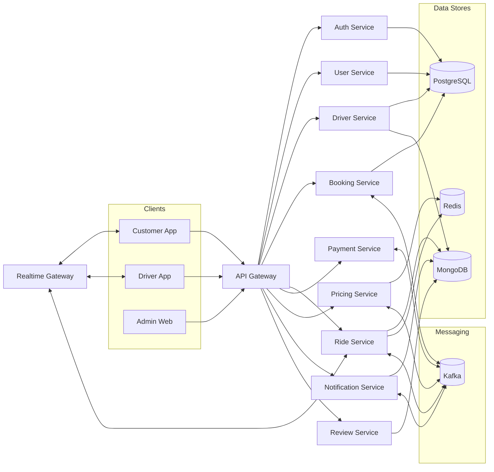
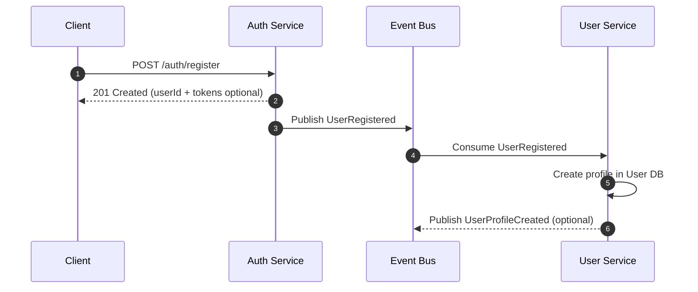
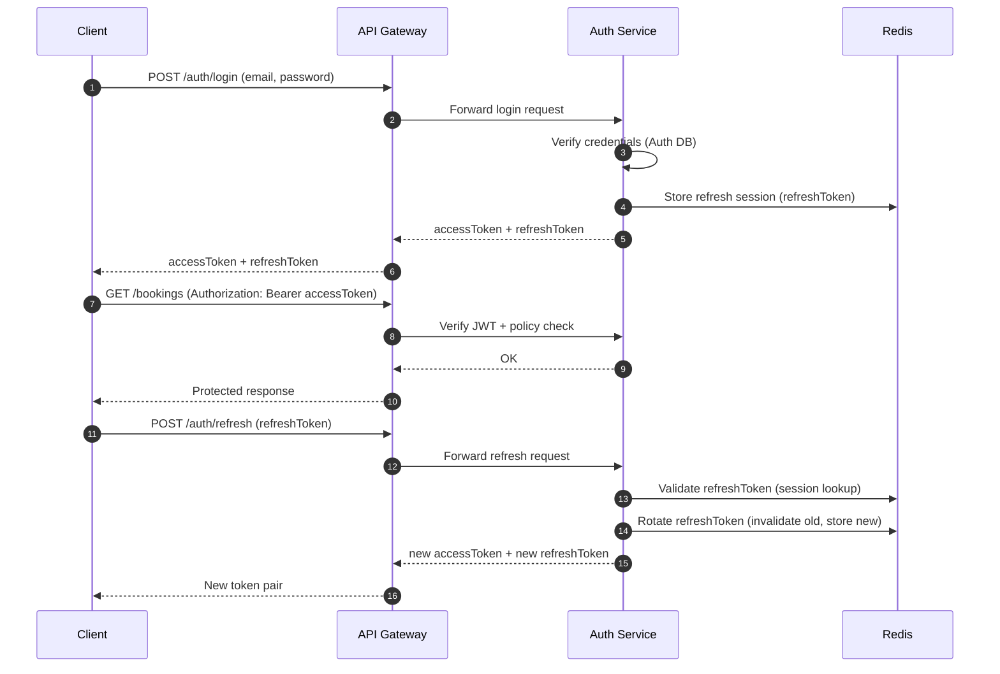
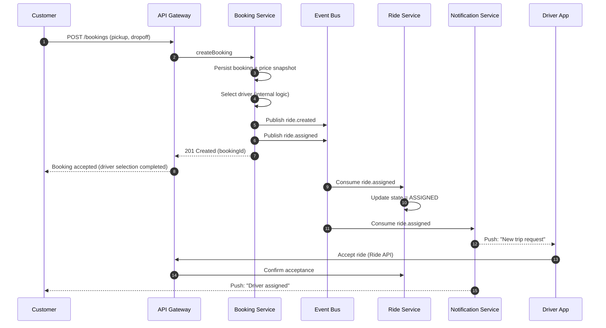
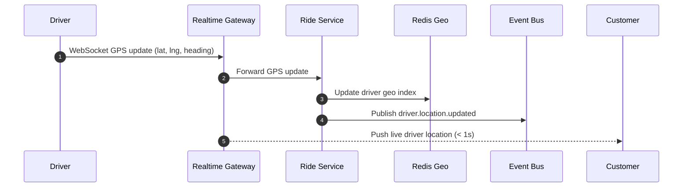
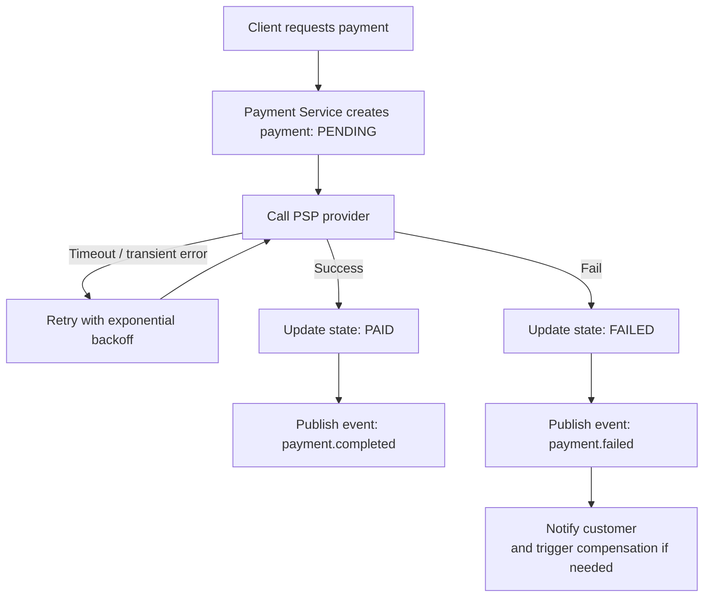

<div align="center">

# 🚕 CAB Booking System  
### Microservices · Real-time · Event-driven · AI-enabled · Zero Trust

A modern taxi/cab booking platform designed for **high scalability**, **near real-time location updates**, **event-driven workflows**, **AI-assisted driver matching**, and **Zero Trust security**.

**Aims:** Microservices · Real-time · Event-driven · AI-enabled · Zero Trust Architecture

</div>

---

## ✨ Table of Contents

- [🚀 Key Features](#-key-features)
- [🏗️ Architecture Overview](#-architecture-overview)
- [🧩 Core Services](#-core-services)
- [🗄️ Data, Messaging, and Real-time Layer](#-data-messaging-and-real-time-layer)
- [🗂️ Repository Structure](#-repository-structure)
- [🔄 System Flows](#-system-flows)
  - [1) Registration → User Profile Creation (Event-driven)](#1-registration--user-profile-creation-event-driven)
  - [2) Login + Refresh Token Rotation (Enterprise Pattern)](#2-login--refresh-token-rotation-enterprise-pattern)
  - [3) Booking End-to-End (Create → Match → Assign → Ride)](#3-booking-end-to-end-create--match--assign--ride)
  - [4) Real-time GPS Update (Driver → Passenger)](#4-real-time-gps-update-driver--passenger)
  - [5) AI Driver Matching (Hard + Soft Constraints, Fallback Ready)](#5-ai-driver-matching-hard--soft-constraints-fallback-ready)
  - [6) Payment Failure Handling + Retry](#6-payment-failure-handling--retry)
  - [7) Payment Saga (Choreography-based, No 2PC)](#7-payment-saga-choreography-based-no-2pc)
  - [8) Surge Pricing (Near Real-time)](#8-surge-pricing-near-real-time)
- [📨 Kafka Topics & Event Schema](#-kafka-topics--event-schema)
- [🧰 Installation & Running Locally](#-installation--running-locally)
- [⚙️ Configuration](#-configuration)
- [🔐 Security Notes (Zero Trust)](#-security-notes-zero-trust)
- [🛡️ Resilience & Failure Handling](#-resilience--failure-handling)

---

## ✨ Key Features

### 🚖 Core Ride Experience
- **Ride Booking** — End-to-end booking lifecycle built on **scalable microservices**.
- **Real-time GPS Tracking** — Live driver ↔ passenger updates with **< 1s perceived latency**.

### 🧠 Intelligence & Optimization
- **AI Driver Matching** — Uses **Redis Geo + Feature Store + scoring** with a safe **rule-based fallback**.
- **ETA Service** — **Event-driven**, cache-first ETA computation; **routing/traffic provider agnostic** and AI-ready.
- **Surge Pricing** — **Near real-time** demand/supply pricing, **decoupled** from the booking flow.

### 🔄 Event-driven Backbone
- **Event-driven Architecture** — Kafka/RabbitMQ powered workflows for **loose coupling**, **high throughput**, and **eventual consistency**.

### 💳 Payments & Consistency
- **Payment Reliability** — **Idempotency**, **retry/backoff**, and a **Saga (choreography-based)** approach for distributed consistency.

### 🔐 Security by Design
- **Zero Trust Security** — End-to-end security from **client → gateway → services → data**, with strict verification and least privilege.
---

## Architecture Overview


## 🏗️ Why this layout?

This architecture is intentionally split into clear layers to keep the platform **secure**, **scalable**, and **easy to evolve**.

- **API Gateway** acts as the *single entry point* and enforces:
  - Authentication & authorization
  - Routing
  - Rate limiting / quotas
  - Request validation (schema, payload constraints)

- **Realtime Gateway** isolates WebSocket traffic so:
  - Real-time connections do not overload business services
  - Location streaming stays low-latency and independent

- **Microservices** follow:
  - **Database-per-service**
  - **Sync communication** via HTTP/REST (request-response)
  - **Async communication** via Events (Kafka/RabbitMQ) for decoupled workflows

---

## 🧩 Core Services

> Service names may vary in your repository. Keep this list aligned with `/services`.

| Service | Responsibility | Key Outputs / Notes |
|--------|----------------|---------------------|
| **API Gateway** | Entry point, routing, authZ/authN, rate limit, validation | Protects all downstream services |
| **Auth Service** | Register/Login, JWT issuance, refresh token rotation, RBAC claims | Issues access/refresh tokens |
| **User Service** | Customer profiles, preferences, ride history | Owns customer domain data |
| **Driver Service** | Driver profile, KYC (optional), availability, vehicle, rating | Owns driver domain data |
| **Booking Service** | Creates ride requests, persists booking, snapshots price | Emits `ride.created` |
| **Ride Service** | Ride lifecycle state machine, ride status updates, coordination | Consumes `ride.assigned`, manages states |
| **Pricing Service** | Fare estimation, surge multiplier, pricing consistency | Provides quote + surge, snapshot per booking |
| **Payment Service** | Payment execution, idempotency, retry/backoff, saga choreography | Emits `payment.completed` / `payment.failed` |
| **Notification Service** | Push/SMS/email/in-app notifications | Consumes ride/payment events |
| **Review Service** | Ratings & feedback after ride completion | Feeds quality + recommendation signals |

---

## 🗄️ Data, Messaging, and Real-time Layer

| Component | Technology | Used For |
|----------|------------|---------|
| **Transactional DB** | **PostgreSQL** | Auth / User / Driver / Booking / Ride data |
| **Document Store** | **MongoDB** | Notifications, Reviews, logs-like documents |
| **Hot Store + Geo** | **Redis** | Ride state cache, pricing metrics, Geo index for nearby queries |
| **Event Backbone** | **Kafka** | Async workflows, decoupling, eventual consistency |
| **Real-time Transport** | **WebSocket** | Driver GPS streaming & passenger live tracking |

---

## 🗂️ Repository Structure

| Folder | What it Contains | Typical Examples |
|-------|-------------------|------------------|
| `apps/` | Frontend clients | `customer-app/`, `driver-app/`, `admin-web/` |
| `services/` | Backend microservices | `auth-service/`, `booking-service/`, `payment-service/`, `gateway/` |
| `contracts/` | API + event contracts | OpenAPI specs, Kafka/RabbitMQ schemas |
| `libs/` | Shared libraries | logging, validation, HTTP clients, auth helpers |
| `infra/` | Local/dev infrastructure | docker-compose, Kafka/Redis/Postgres configs |
| `scripts/` | Automation helpers | migrations, seeding, lint/test helpers |
| `docs/` | Architecture & runbooks | diagrams, ADRs, operational guides |

This README follows the repository layout below.

```text
.
├── apps/                                # Frontend clients
│   ├── customer-app/                    # Customer UI (book ride, track, pay, rate)
│   ├── driver-app/                      # Driver UI (online/offline, accept rides, GPS)
│   └── admin-dashboard/                 # Admin/ops UI (monitoring, management, pricing)
│
├── services/                            # Backend microservices (domain-driven)
│   ├── api-gateway/                     # Entry point: auth, routing, rate limit, validation
│   ├── auth-service/                    # Register/login, JWT, refresh token rotation
│   ├── user-service/                    # Customer profiles, preferences, history
│   ├── driver-service/                  # Driver profile, availability, KYC (optional)
│   ├── booking-service/                 # Create booking, price snapshot, emit ride.created
│   ├── ride-service/                    # Ride lifecycle, state machine, ride status
│   ├── matching-service/                # AI matching + fallback rules, emit ride.assigned
│   ├── pricing-service/                 # Fare estimation, surge multiplier, zone pricing
│   ├── eta-service/                     # Event-driven ETA, cache-first, provider-agnostic
│   ├── payment-service/                 # Idempotent payments, retry/backoff, saga events
│   ├── notification-service/            # Push/SMS/email notifications from events
│   └── review-service/                  # Ratings & feedback after ride completion
│
├── contracts/                           # Contracts = single source of truth
│   ├── openapi/                         # REST specs (Swagger/OpenAPI)
│   │   ├── gateway.yaml
│   │   ├── booking.yaml
│   │   └── payment.yaml
│   ├── events/                          # Async event schemas (Kafka/RabbitMQ)
│   │   ├── ride.created.json
│   │   ├── ride.assigned.json
│   │   ├── driver.location.updated.json
│   │   ├── payment.completed.json
│   │   └── payment.failed.json
│   └── README.md                        # Contract versioning rules & conventions
│
├── libs/                                # Shared libraries (reused across services)
│   ├── common/                          # Shared utilities (helpers, constants, types)
│   ├── logger/                          # Structured logging + correlation IDs
│   ├── auth/                            # JWT helpers, RBAC/ABAC utilities, guards
│   ├── http-client/                     # Typed HTTP clients, retries, timeouts
│   ├── kafka/                           # Producer/consumer wrappers, serializers
│   ├── validation/                      # Request validation, schema utilities
│   └── observability/                   # Metrics/tracing helpers (OTEL, Prometheus)
│
├── infra/                               # Infrastructure for local/dev & production patterns
│   ├── docker/                          # Dockerfiles and runtime configs
│   ├── compose/                         # docker-compose files (kafka, redis, postgres...)
│   ├── kafka/                           # Broker config, topics, init scripts
│   ├── postgres/                        # Init scripts, migrations, seed data
│   ├── redis/                           # Redis config (geo index, cache policies)
│   ├── monitoring/                      # Prometheus/Grafana, dashboards
│   └── k8s/                             # Kubernetes manifests/Helm charts (optional)
│
├── scripts/                             # Developer utilities & automation
│   ├── bootstrap.sh                     # One-command setup (deps + infra)
│   ├── migrate.sh                       # Run DB migrations
│   ├── seed.sh                          # Seed demo/test data
│   ├── lint.sh                          # Lint runner
│   └── test.sh                          # Test runner
│
├── docs/                                # Documentation & decision records
│   ├── architecture/                    # High-level architecture docs + diagrams
│   ├── diagrams/                        # Mermaid/PNG architecture & sequence diagrams
│   ├── adr/                             # Architecture Decision Records
│   ├── runbooks/                        # Operational guides (incident response, SRE)
│   └── api/                             # API usage examples, Postman collections
│
├── package.json                         # Root scripts/workspaces
├── README.md                            # Project overview (this file)
└── LICENSE                              # License (if public)
```

## 🔄 System Flows

### 1) Registration → User Profile Creation (Event-driven)

**Goal:** Keep **Auth** isolated from business/profile data while ensuring user profiles are created **automatically** via events.


✅ Benefits

Clear separation of concerns:
Auth stores credentials only, while User Service owns profile/business data.

Loose coupling:
Services communicate via events → easier to evolve independently.

Future-proof identity:
Easy to replace Auth with OAuth2 / SSO without changing profile logic.

### 2) Login + Refresh Token Rotation (Enterprise Pattern)

**Goal:** Protect sessions using **short-lived access tokens** and **rotating refresh tokens** (reduces risk if a refresh token leaks).


✅ Key points

Access Token is short-lived → limits damage if stolen.

Refresh Token Rotation invalidates the previous refresh token on each refresh → prevents replay.

Redis-backed sessions allow fast checks, revocation, and logout across devices.

Gateway enforcement keeps auth/policy verification consistent across all services.
### 3) Booking End-to-End (Create → Assign → Ride) — *No Separate Matching Service*

**Goal:** Keep the workflow **simple and consistent** by handling driver selection inside the **Booking Service** (no dedicated Matching microservice).

**High-level lifecycle**
1. Customer requests a ride.
2. Booking Service stores booking + **price snapshot**.
3. Booking Service selects a driver (rule-based / internal logic) and publishes `ride.assigned`.
4. Ride Service updates state; Notification Service pushes updates to Driver & Customer.


✅ Notes

Price snapshot guarantees billing consistency even if surge changes later.

Removing a separate Matching service reduces operational complexity for smaller systems.

You can later extract Matching into its own service if load/ML requirements grow (no contract change needed if you keep the same events).

### 4) Real-time GPS Update (Driver → Passenger) — *No ETA Service*

**Goal:** Deliver **near real-time** driver location updates to passengers via WebSocket, while still publishing events for **monitoring/analytics** (optional) without coupling them to the realtime channel.

**Flow summary**
- Driver streams GPS updates through **WebSocket** to the Realtime Gateway.
- Realtime Gateway forwards updates to **Ride Service**.
- Ride Service updates **Redis Geo** for fast geo queries and publishes `driver.location.updated`.
- Passenger receives live driver location updates via WebSocket.


✅ Notes

Redis Geo supports fast geo queries (e.g., “drivers near pickup point”).

Events (driver.location.updated) let you plug in monitoring/analytics later without changing the realtime flow.

WebSocket is optimized for UI latency; Redis/Event Bus support scalability behind the scenes.

### 5) Payment Failure Handling + Retry

**Goal:** Payments must be **non-blocking** and resilient to **PSP latency/outages** while ensuring consistent state across services.

**Principles**
- **Retry with exponential backoff** on timeouts/transient failures  
- **Payment Service = source of truth** (single authoritative payment state)
- **Event-driven updates** for eventual consistency across the platform
- **PSP-agnostic design** (easy to add/switch multiple PSP providers)


✅ Notes

Use an idempotency key per payment attempt to prevent double charging.

Treat timeouts as unknown outcomes → retry safely, then reconcile if needed.

Consumers (Ride/Booking/Notification/Wallet) should be idempotent when handling payment events.

---

## 📨 Kafka Topics & Event Schema

> Keep topics **domain-oriented**, use consistent naming, and ensure consumers are **idempotent**.

### Core Topics

| Topic | Producer | Consumers |
|------|----------|-----------|
| `ride.created` | Booking Service | *(Optional)* internal booking handlers / future extensions |
| `ride.assigned` | Booking Service | Notification Service, Ride Service |
| `driver.location.updated` | Ride Service | *(Optional)* Monitoring/Analytics |
| `payment.completed` | Payment Service | Ride Service, *(Optional)* Wallet/Ledger |
| `payment.failed` | Payment Service | Notification Service |

> ✅ Adjust consumers based on your actual implementation (you mentioned **no ETA** and **no separate Matching service**).

### Example Event Payload — `ride.created`
```json
{
  "eventId": "uuid",
  "type": "RideCreated",
  "rideId": "r123",
  "pickup": { "lat": 10.7, "lng": 106.6 },
  "timestamp": "2025-01-01T10:00:00Z"
}
```
Recommended event fields

eventId: unique UUID (supports deduplication)

type: event type name (stable contract)

timestamp: ISO-8601 time for ordering/debug

data (optional): nested object for payload versioning

---

## 🧰 Installation & Running Locally

### ✅ Prerequisites
- **Docker** + **Docker Compose**
- **Node.js 18+** (npm included)

### 1) Start infrastructure & services (Docker Compose)
From the repository root (or `infra/` depending on your setup):

```bash
docker compose up --build
This typically starts:

API Gateway

Core services (auth, booking, ride, payment, notification, …)

Kafka (or RabbitMQ)

PostgreSQL

Redis

(Optional) MongoDB

💡 Tip: follow logs to confirm everything is healthy:

docker compose logs -f
2) Verify the system
Endpoints (examples)

API Gateway: http://localhost:3000

Auth Service: http://localhost:3001

Example — Register a user

curl -X POST http://localhost:3001/auth/register \
  -H "Content-Type: application/json" \
  -d '{"email":"test@mail.com","password":"123456"}'
3) Developer mode (run a single service)
Run infrastructure in Docker, run one service locally for faster iteration:

cd services/auth-service
npm install
npm run dev
⚙️ Configuration
Each service should have its own .env.

Example — services/auth-service/.env

PORT=3001

DB_HOST=postgres
DB_NAME=auth_db
DB_USER=postgres
DB_PASSWORD=postgres

JWT_SECRET=super_secret_key
JWT_EXPIRES_IN=15m
REFRESH_TOKEN_EXPIRES_IN=7d
Best practices

🔒 Never commit secrets → use .env.example + secrets manager in production

🧱 Database-per-service → avoid cross-service DB coupling

🧩 Standardize env naming → DB_*, REDIS_URL, KAFKA_BROKERS, etc.

🔐 Security Notes (Zero Trust)
Never trust, always verify.

Edge security: TLS, WAF protections, rate limiting

API Gateway (Policy Enforcement Point):

JWT/OAuth2 validation

RBAC/ABAC permission checks

Quotas + strict schema validation

Service-to-service security: mTLS, service identity (service-mesh ready)

IAM best practices: short-lived access tokens + refresh rotation/revocation (Redis session store)

Audit logging: login/refresh, payments, permission changes

🛡️ Resilience & Failure Handling
Recommended patterns

Circuit breaker

Retry + exponential backoff

Bulkhead isolation

Idempotency keys (especially payments)

Eventual consistency

Graceful degradation (fallback strategies)

Common failure examples

WebSocket disconnect → auto-reconnect, fallback polling

Payment PSP timeout → retry/backoff; provider down → failover strategy

Kafka lag → scale consumers; tune partitions
```
