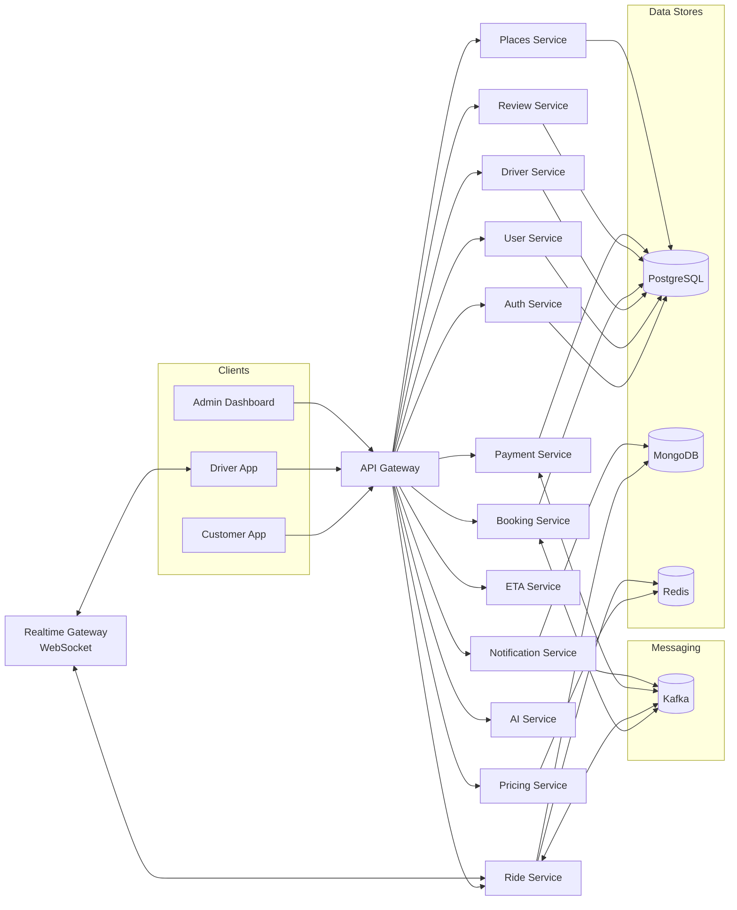
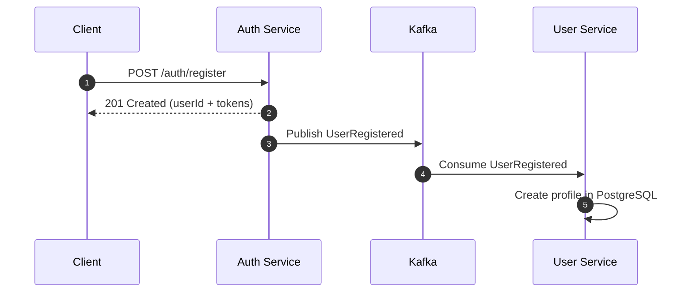
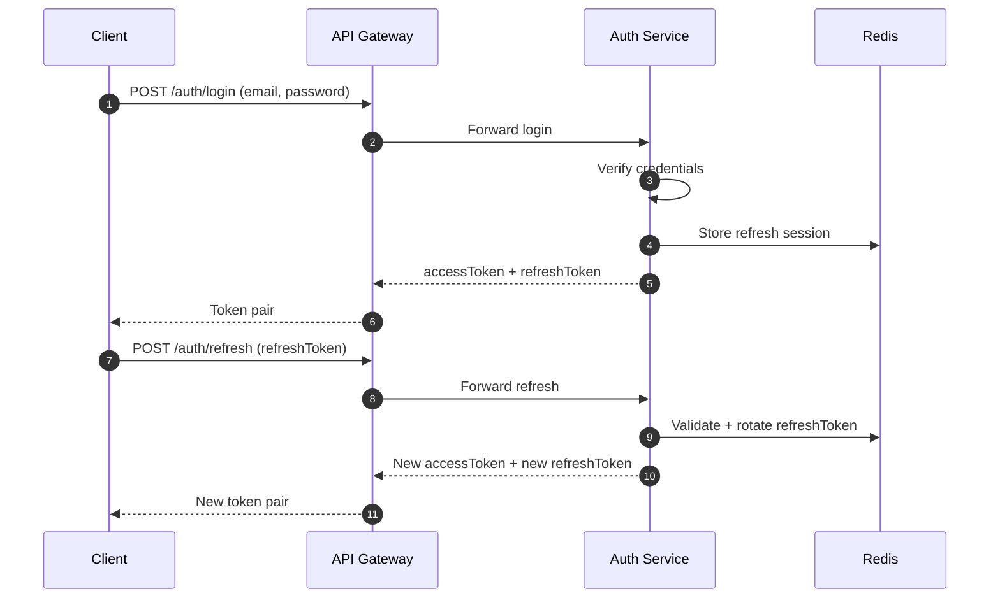
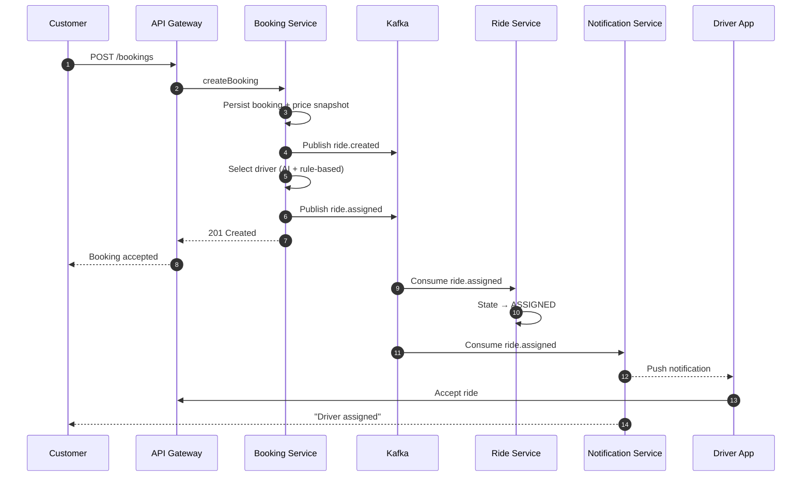
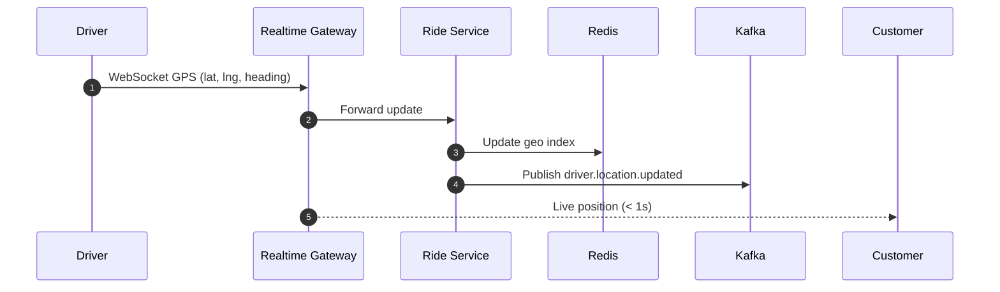
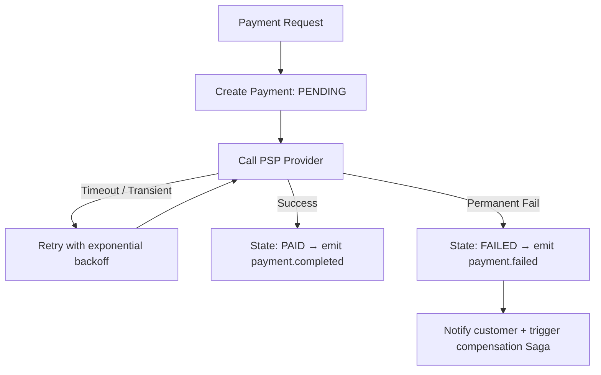

<div align="center">

# 🚕 CAB Booking System

[](https://nodejs.org/)
[](https://docs.docker.com/compose/)
[](https://kafka.apache.org/)
[](https://www.postgresql.org/)
[](https://redis.io/)
[](https://www.mongodb.com/)

**Microservices · Event-Driven · Real-time GPS · AI Matching · Zero Trust**

A modern ride-hailing platform built for **high scalability**, **sub-second live tracking**, **event-driven workflows**, and **Zero Trust security** — powered by a polyglot persistence layer with full observability.

</div>

---

## ✨ Key Features

| Category | Feature | Description |
|----------|---------|-------------|
| 🚖 **Ride Experience** | Booking Lifecycle | End-to-end booking flow across 13 microservices |
| | Real-time GPS | Driver ↔ passenger live tracking with < 1s latency via WebSocket |
| 🧠 **Intelligence** | AI Driver Matching | Redis Geo + scoring engine with rule-based fallback |
| | Smart ETA | Event-driven, cache-first ETA computation; routing provider agnostic |
| | Surge Pricing | Near real-time demand/supply pricing, decoupled from booking flow |
| 🔄 **Event Backbone** | Apache Kafka | Loose coupling, high throughput, eventual consistency |
| 💳 **Payments** | Idempotent Payments | Retry/backoff, PSP-agnostic design, VietQR & PayOS integration |
| | Saga Pattern | Choreography-based distributed transactions (no 2PC) |
| 🔐 **Security** | Zero Trust | mTLS-ready, JWT + refresh rotation, RBAC, strict validation at gateway |
| 📈 **Observability** | ELK + OTel | Centralized logging, distributed tracing, Prometheus + Grafana metrics |

---

## 🏗️ Architecture



**API Gateway** — single entry point enforcing auth, routing, rate limiting, and schema validation.
**Realtime Gateway** — isolates WebSocket traffic for low-latency GPS streaming.
**Database-per-service** — each microservice owns its data store.
**Kafka** — async event backbone for all cross-service workflows.

---

## 🧩 Services

| # | Service | Port | Database | Responsibility |
|---|---------|------|----------|----------------|
| 1 | `api-gateway` | 3000 | — | Entry point: auth, routing, rate limiting, validation |
| 2 | `auth-service` | 4001 | PostgreSQL | Register, login, JWT issuance, refresh token rotation |
| 3 | `user-service` | 4004 | PostgreSQL | Customer profiles, preferences, ride history |
| 4 | `driver-service` | 3011 | PostgreSQL + Redis | Driver profile, availability, GPS state |
| 5 | `booking-service` | 3003 | PostgreSQL | Create booking, price snapshot, driver selection, emit events |
| 6 | `ride-service` | 3005 | MongoDB + Redis | Ride lifecycle state machine, real-time GPS relay |
| 7 | `pricing-service` | 3006 | Redis | Fare estimation, surge multiplier, coupons |
| 8 | `payment-service` | 3007 | PostgreSQL + Redis | Payment execution, idempotency, VietQR/PayOS, Saga |
| 9 | `eta-service` | 3012 | — | Event-driven ETA computation, cache-first |
| 10 | `places-service` | 3014 | PostgreSQL | Address autocomplete, geocoding (OpenStreetMap) |
| 11 | `ai-service` | 3013 | — | AI-assisted driver matching engine |
| 12 | `notification-service` | 3010 | MongoDB | Push/SMS/email notifications from Kafka events |
| 13 | `review-service` | 3009 | PostgreSQL + Redis | Ratings & feedback after ride completion |

---

## 🗄️ Tech Stack

| Layer | Technology | Purpose |
|-------|-----------|---------|
| **Runtime** | Node.js 20+ | Backend services + frontend tooling |
| **API Framework** | Express.js | REST endpoints for all microservices |
| **Real-time** | WebSocket | Driver GPS streaming to passengers |
| **Relational DB** | PostgreSQL 16 | Auth, users, drivers, bookings, payments, reviews, places |
| **Document DB** | MongoDB 7 | Rides, notifications |
| **Cache + Geo** | Redis 7 | Ride state cache, pricing metrics, geo-spatial queries |
| **Messaging** | Apache Kafka 7.6 | Async event backbone, outbox/inbox pattern |
| **Observability** | Elasticsearch, Logstash, Kibana, Prometheus, Tempo, Grafana, OpenTelemetry | Logs, metrics, distributed tracing |
| **Mobile** | React Native (Expo) | Customer & Driver apps |
| **Web** | React + Vite | Admin dashboard |
| **Infra** | Docker Compose | Local development & staging |

---

## 📂 Project Structure

```
cab-booking-system/
├── apps/                              # Frontend clients
│   ├── customer-app/                  # React Native (Expo) — ride booking, live tracking
│   ├── driver-app/                    # React Native (Expo) — ride acceptance, GPS streaming
│   └── admin-dashboard/               # React + Vite — monitoring, management
│
├── services/                          # Backend microservices (13 services)
│   ├── api-gateway/                   # Entry point, routing, auth enforcement
│   ├── auth-service/                  # Registration, login, JWT, refresh tokens
│   ├── user-service/                  # Customer profiles & history
│   ├── driver-service/                # Driver profiles, availability, GPS
│   ├── booking-service/               # Booking creation, price snapshot, events
│   ├── ride-service/                  # Ride lifecycle, GPS relay, Redis geo-index
│   ├── pricing-service/               # Fare estimation, surge multiplier, coupons
│   ├── payment-service/               # Payment processing, VietQR, PayOS, Saga
│   ├── eta-service/                   # Cache-first ETA computation
│   ├── places-service/                # Address search, geocoding
│   ├── ai-service/                    # AI driver matching engine
│   ├── notification-service/          # Push/SMS/email notifications
│   └── review-service/                # Post-ride ratings & reviews
│
├── libs/                              # Shared libraries
│   ├── http/                          # Typed HTTP client with retries & circuit breaker
│   ├── kafka/                         # Producer/consumer wrappers, serialization
│   ├── observability/                 # OpenTelemetry helpers, metrics, tracing
│   ├── resilience/                    # Circuit breaker, retry, bulkhead patterns
│   ├── security/                      # JWT helpers, RBAC utilities
│   ├── types/                         # Generated TypeScript types from OpenAPI specs
│   └── validation/                    # Request schema validation
│
├── contracts/                         # Single source of truth
│   ├── openapi/                       # REST API specs (12 YAML files)
│   ├── events/                        # Kafka event schemas & catalog
│   └── state-machines/                # Payment & ride state machine diagrams
│
├── infra/                             # Infrastructure as Code
│   ├── docker-compose.dev.yml         # Full dev stack (services + Kafka + DBs)
│   ├── docker-compose.kafka.prodlike.yml  # Production-like Kafka cluster
│   ├── docker-compose.pro.yml         # Production compose
│   ├── postgres/                      # Init scripts & seed SQL
│   ├── mongo/                         # MongoDB init scripts
│   ├── kafka/                         # Kafka configs & topic bootstrapping
│   ├── env/                           # Environment-specific override files
│   └── observability/                 # Observability stack compose
│
├── scripts/                           # Automation & testing
│   ├── healthcheck.js                 # Service health verification
│   ├── seed-all.js                    # Seed demo data across all services
│   ├── start-all.ps1                  # Full stack launcher (Windows)
│   ├── start-all.cmd                  # Full stack launcher wrapper
│   ├── test-all-services.sh           # Run all test suites
│   └── test-level*-*.sh               # Level-specific test suites (1–10)
│
├── docs/                              # Architecture & operations
│   ├── adr/                           # Architecture Decision Records
│   ├── architecture/                  # High-level diagrams & docs
│   ├── runbooks/                      # Incident response & SRE guides
│   ├── observability/                 # Observability setup & migration notes
│   └── sequence-diagrams/             # Detailed flow diagrams
│
├── .env                               # Environment variables (gitignored)
├── package.json                       # Root workspace config & npm scripts
└── README.md                          # ← This file
```

---

## 🔄 System Flows

### 1. Registration → User Profile (Event-driven)

Auth stores credentials only; User Service owns profile data — decoupled via Kafka.



✅ Clear separation of concerns · Loose coupling via events · Easy to swap Auth for OAuth2/SSO

### 2. Login + Refresh Token Rotation

Short-lived access tokens + rotating refresh tokens stored in Redis for fast validation and revocation.



✅ Short-lived access tokens · Refresh rotation prevents replay · Redis-backed fast lookup & revocation

### 3. Booking End-to-End

Customer requests ride → Booking snapshots price → selects driver → Ride Service manages lifecycle.



✅ Price snapshot ensures billing consistency · AI matching with rule-based fallback

### 4. Real-time GPS Tracking

Driver streams GPS via WebSocket → Ride Service updates Redis Geo → Passenger gets live position.



✅ Redis Geo for spatial queries · Kafka events for analytics/monitoring · WebSocket optimized for UI latency

### 5. AI Driver Matching

Redis Geo for spatial queries + feature scoring engine + rule-based fallback for reliability.

### 6. Payment Processing

Idempotent payment → PSP call (VietQR/PayOS) → retry with exponential backoff → Saga on failure.



✅ Idempotency keys prevent double-charging · PSP-agnostic design · Event-driven state propagation

### 7. Payment Saga (Choreography)

No central orchestrator. Each service reacts to payment events independently — `payment.completed` triggers ride activation, `payment.failed` triggers booking compensation.

### 8. Surge Pricing

Pricing Service monitors demand/supply ratio in Redis → adjusts surge multiplier in near real-time → Booking snapshots price at creation time for billing consistency.

---

## 📨 Kafka Topics

| Topic | Producer | Consumers |
|-------|----------|-----------|
| `ride.created` | `booking-service` | `payment-service`, `ride-service` |
| `ride.assigned` | `ride-service` | `payment-service`, `ride-service` |
| `ride.cancelled` | `booking-service` | `payment-service`, `ride-service` |
| `driver.location.updated` | `ride-service` | — (analytics/monitoring) |
| `payment.completed` | `payment-service` | `ride-service` |
| `payment.failed` | `payment-service` | `ride-service` |
| `review.created` | `review-service` | — |

> Topics bootstrapped via `npm run kafka:topics:bootstrap`. Event schemas live in `contracts/events/`.

---

## 🚀 Quick Start

### Prerequisites

- **Docker Desktop** with Compose v2
- **Node.js 18+**

### 1. Start the full stack

```bash
git clone <repo-url> && cd cab-booking-system
npm run dev:infra
```

Launches 13 microservices + PostgreSQL, MongoDB, Redis, Kafka, Zookeeper.

### 2. Bootstrap Kafka topics

```bash
npm run kafka:topics:bootstrap
```

### 3. Seed demo data

```bash
npm run seed:all
```

### 4. Verify health

```bash
npm run health
```

### Useful Commands

| Command | Description |
|---------|-------------|
| `npm run dev:infra` | Start all services + infrastructure |
| `npm run dev:observability` | Start services + ELK + Grafana + Tempo + Prometheus |
| `npm run down:infra` | Stop and remove all containers & volumes |
| `npm run logs:kafka` | Tail Kafka logs |
| `npm run health` | Check API Gateway health (`http://localhost:3000/health`) |
| `npm run seed:all` | Seed demo data across all services |
| `npm run kafka:topics:bootstrap` | Create all required Kafka topics |
| `npm run test:level5` | Run test suite level 5 (cases 41–50) |
| `npm run test:level6` | Run test suite level 6 (cases 51–60) |
| `npm run contracts:events:validate` | Validate event schemas |
| `npm run contracts:events:compat` | Check backward compatibility of events |

### Developer Mode (single service)

```bash
npm run dev:infra    # Start infra only
cd services/auth-service
npm install
npm run dev          # Runs with nodemon on localhost
```

---

## 📈 Observability

| Component | Endpoint | Purpose |
|-----------|----------|---------|
| **Kibana** | `http://localhost:5601` | Log exploration & dashboards |
| **Elasticsearch** | `http://localhost:9200` | Log storage & indexing |
| **Grafana** | `http://localhost:3001` | Metrics + trace visualization |
| **Prometheus** | `http://localhost:9090` | Metrics collection |
| **Tempo** | `http://localhost:3200` | Distributed tracing backend |

### Data Flow

```
Logs:    Container stdout → Logstash → Elasticsearch → Kibana
Traces:  OpenTelemetry SDK → OTel Collector → Tempo → Grafana
Metrics: OpenTelemetry SDK → OTel Collector → Prometheus → Grafana
```

### Verification

```bash
curl -s http://localhost:9200/_cluster/health?pretty
curl -s http://localhost:9200/_cat/indices/cab-logs-*?v
curl -s "http://localhost:9200/cab-logs-*/_search?size=5&sort=@timestamp:desc"
```

> In Kibana: create data view `cab-logs-*` → filter by `service.name` and `level`.
>
> **Docker Desktop**: uses `host.docker.internal` for Logstash syslog forwarding.
> **Linux Docker Engine**: set `LOGSTASH_SYSLOG_HOST` to a reachable host/IP for Logstash port `5514`.

---

## 🔐 Security

| Layer | Mechanism |
|-------|-----------|
| **Edge** | TLS (HTTPS), rate limiting, Helmet headers |
| **Gateway** | JWT validation, RBAC enforcement, strict schema validation |
| **Service-to-Service** | Internal API keys, mTLS-ready architecture |
| **Sessions** | Short-lived access tokens + rotating refresh tokens (Redis-backed) |
| **Audit** | Login/refresh, payment events, permission changes logged centrally |

---

## 🛡️ Resilience

| Pattern | Implementation |
|---------|---------------|
| **Circuit Breaker** | Per-service circuit breakers at API Gateway with configurable thresholds |
| **Retry + Backoff** | Exponential backoff on Kafka consumers & HTTP clients |
| **Idempotency** | Idempotency keys on all payment & booking mutations |
| **Outbox Pattern** | Guaranteed event publication via transactional outbox |
| **Inbox Pattern** | Deduplicated event consumption via idempotent inbox |
| **Graceful Degradation** | Pricing fallback to cached rates, AI fallback to rule-based matching |

---

## 📄 License

MIT

---

<div align="center">
  <sub>Built for scalability, reliability, and developer experience.</sub>
</div>

## 📈 Observability

| Component | Endpoint | Purpose |
|-----------|----------|---------|
| **Kibana** | `http://localhost:5601` | Log exploration & dashboards |
| **Elasticsearch** | `http://localhost:9200` | Log storage & indexing |
| **Grafana** | `http://localhost:3001` | Metrics + trace visualization |
| **Prometheus** | `http://localhost:9090` | Metrics collection |
| **Tempo** | `http://localhost:3200` | Distributed tracing backend |

### Data Flow

```
Logs:    Container stdout → Logstash → Elasticsearch → Kibana
Traces:  OpenTelemetry SDK → OTel Collector → Tempo → Grafana
Metrics: OpenTelemetry SDK → OTel Collector → Prometheus → Grafana
```

### Verification

```bash
curl -s http://localhost:9200/_cluster/health?pretty
curl -s http://localhost:9200/_cat/indices/cab-logs-*?v
curl -s "http://localhost:9200/cab-logs-*/_search?size=5&sort=@timestamp:desc"
```

> In Kibana: create data view `cab-logs-*` → filter by `service.name` and `level`.
>
> **Docker Desktop**: uses `host.docker.internal` for Logstash syslog forwarding.
> **Linux Docker Engine**: set `LOGSTASH_SYSLOG_HOST` to a reachable host/IP for Logstash port `5514`.

---

## 🔐 Security

| Layer | Mechanism |
|-------|-----------|
| **Edge** | TLS (HTTPS), rate limiting, Helmet headers |
| **Gateway** | JWT validation, RBAC enforcement, strict schema validation |
| **Service-to-Service** | Internal API keys, mTLS-ready architecture |
| **Sessions** | Short-lived access tokens + rotating refresh tokens (Redis-backed) |
| **Audit** | Login/refresh, payment events, permission changes logged centrally |

---

## 🛡️ Resilience

| Pattern | Implementation |
|---------|---------------|
| **Circuit Breaker** | Per-service circuit breakers at API Gateway with configurable thresholds |
| **Retry + Backoff** | Exponential backoff on Kafka consumers & HTTP clients |
| **Idempotency** | Idempotency keys on all payment & booking mutations |
| **Outbox Pattern** | Guaranteed event publication via transactional outbox |
| **Inbox Pattern** | Deduplicated event consumption via idempotent inbox |
| **Graceful Degradation** | Pricing fallback to cached rates, AI fallback to rule-based matching |

---

## 📄 License

MIT

---

<div align="center">
  <sub>Built for scalability, reliability, and developer experience.</sub>
</div>
