<div align="center">

# 🚕 CAB Booking System

[](https://nodejs.org/)
[](https://docs.docker.com/compose/)
[](https://kafka.apache.org/)
[](https://www.postgresql.org/)
[](https://redis.io/)
[](https://www.mongodb.com/)

**Microservices · Event-Driven · Real-time GPS · AI Matching · Zero Trust**

A modern ride-hailing platform built for **high scalability**, **sub-second live tracking**, **event-driven workflows**, and **Zero Trust security** — powered by a polyglot persistence layer with full observability.

</div>

---

## ✨ Key Features

| Category | Feature | Description |
|----------|---------|-------------|
| 🚖 **Ride Experience** | Booking Lifecycle | End-to-end booking flow across 13 microservices |
| | Real-time GPS | Driver ↔ passenger live tracking with < 1s latency via WebSocket |
| 🧠 **Intelligence** | AI Driver Matching | Redis Geo + scoring engine with rule-based fallback |
| | Smart ETA | Event-driven, cache-first ETA computation; routing provider agnostic |
| | Surge Pricing | Near real-time demand/supply pricing, decoupled from booking flow |
| 🔄 **Event Backbone** | Apache Kafka | Loose coupling, high throughput, eventual consistency |
| 💳 **Payments** | Idempotent Payments | Retry/backoff, PSP-agnostic design, VietQR & PayOS integration |
| | Saga Pattern | Choreography-based distributed transactions (no 2PC) |
| 🔐 **Security** | Zero Trust | mTLS-ready, JWT + refresh rotation, RBAC, strict validation at gateway |
| 📈 **Observability** | ELK + OTel | Centralized logging, distributed tracing, Prometheus + Grafana metrics |

---

## 🏗️ Architecture

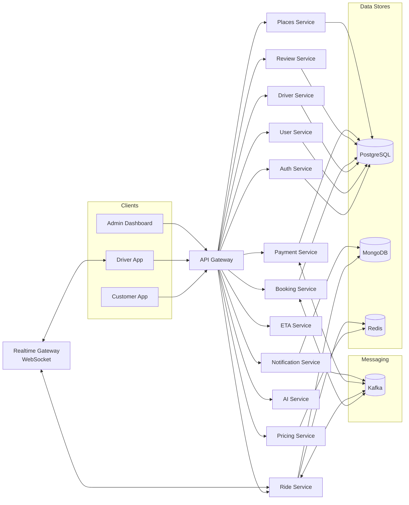

**API Gateway** — single entry point enforcing auth, routing, rate limiting, and schema validation.
**Realtime Gateway** — isolates WebSocket traffic for low-latency GPS streaming.
**Database-per-service** — each microservice owns its data store.
**Kafka** — async event backbone for all cross-service workflows.

---

## 🧩 Services

| # | Service | Port | Database | Responsibility |
|---|---------|------|----------|----------------|
| 1 | `api-gateway` | 3000 | — | Entry point: auth, routing, rate limiting, validation |
| 2 | `auth-service` | 4001 | PostgreSQL | Register, login, JWT issuance, refresh token rotation |
| 3 | `user-service` | 4004 | PostgreSQL | Customer profiles, preferences, ride history |
| 4 | `driver-service` | 3011 | PostgreSQL + Redis | Driver profile, availability, GPS state |
| 5 | `booking-service` | 3003 | PostgreSQL | Create booking, price snapshot, driver selection, emit events |
| 6 | `ride-service` | 3005 | MongoDB + Redis | Ride lifecycle state machine, real-time GPS relay |
| 7 | `pricing-service` | 3006 | Redis | Fare estimation, surge multiplier, coupons |
| 8 | `payment-service` | 3007 | PostgreSQL + Redis | Payment execution, idempotency, VietQR/PayOS, Saga |
| 9 | `eta-service` | 3012 | — | Event-driven ETA computation, cache-first |
| 10 | `places-service` | 3014 | PostgreSQL | Address autocomplete, geocoding (OpenStreetMap) |
| 11 | `ai-service` | 3013 | — | AI-assisted driver matching engine |
| 12 | `notification-service` | 3010 | MongoDB | Push/SMS/email notifications from Kafka events |
| 13 | `review-service` | 3009 | PostgreSQL + Redis | Ratings & feedback after ride completion |

---

## 🗄️ Tech Stack

| Layer | Technology | Purpose |
|-------|-----------|---------|
| **Runtime** | Node.js 20+ | Backend services + frontend tooling |
| **API Framework** | Express.js | REST endpoints for all microservices |
| **Real-time** | WebSocket | Driver GPS streaming to passengers |
| **Relational DB** | PostgreSQL 16 | Auth, users, drivers, bookings, payments, reviews, places |
| **Document DB** | MongoDB 7 | Rides, notifications |
| **Cache + Geo** | Redis 7 | Ride state cache, pricing metrics, geo-spatial queries |
| **Messaging** | Apache Kafka 7.6 | Async event backbone, outbox/inbox pattern |
| **Observability** | Elasticsearch, Logstash, Kibana, Prometheus, Tempo, Grafana, OpenTelemetry | Logs, metrics, distributed tracing |
| **Mobile** | React Native (Expo) | Customer & Driver apps |
| **Web** | React + Vite | Admin dashboard |
| **Infra** | Docker Compose | Local development & staging |

---

## 📂 Project Structure

```
cab-booking-system/
├── apps/                              # Frontend clients
│   ├── customer-app/                  # React Native (Expo) — ride booking, live tracking
│   ├── driver-app/                    # React Native (Expo) — ride acceptance, GPS streaming
│   └── admin-dashboard/               # React + Vite — monitoring, management
│
├── services/                          # Backend microservices (13 services)
│   ├── api-gateway/                   # Entry point, routing, auth enforcement
│   ├── auth-service/                  # Registration, login, JWT, refresh tokens
│   ├── user-service/                  # Customer profiles & history
│   ├── driver-service/                # Driver profiles, availability, GPS
│   ├── booking-service/               # Booking creation, price snapshot, events
│   ├── ride-service/                  # Ride lifecycle, GPS relay, Redis geo-index
│   ├── pricing-service/               # Fare estimation, surge multiplier, coupons
│   ├── payment-service/               # Payment processing, VietQR, PayOS, Saga
│   ├── eta-service/                   # Cache-first ETA computation
│   ├── places-service/                # Address search, geocoding
│   ├── ai-service/                    # AI driver matching engine
│   ├── notification-service/          # Push/SMS/email notifications
│   └── review-service/                # Post-ride ratings & reviews
│
├── libs/                              # Shared libraries
│   ├── http/                          # Typed HTTP client with retries & circuit breaker
│   ├── kafka/                         # Producer/consumer wrappers, serialization
│   ├── observability/                 # OpenTelemetry helpers, metrics, tracing
│   ├── resilience/                    # Circuit breaker, retry, bulkhead patterns
│   ├── security/                      # JWT helpers, RBAC utilities
│   ├── types/                         # Generated TypeScript types from OpenAPI specs
│   └── validation/                    # Request schema validation
│
├── contracts/                         # Single source of truth
│   ├── openapi/                       # REST API specs (12 YAML files)
│   ├── events/                        # Kafka event schemas & catalog
│   └── state-machines/                # Payment & ride state machine diagrams
│
├── infra/                             # Infrastructure as Code
│   ├── docker-compose.dev.yml         # Full dev stack (services + Kafka + DBs)
│   ├── docker-compose.kafka.prodlike.yml  # Production-like Kafka cluster
│   ├── docker-compose.pro.yml         # Production compose
│   ├── postgres/                      # Init scripts & seed SQL
│   ├── mongo/                         # MongoDB init scripts
│   ├── kafka/                         # Kafka configs & topic bootstrapping
│   ├── env/                           # Environment-specific override files
│   └── observability/                 # Observability stack compose
│
├── scripts/                           # Automation & testing
│   ├── healthcheck.js                 # Service health verification
│   ├── seed-all.js                    # Seed demo data across all services
│   ├── start-all.ps1                  # Full stack launcher (Windows)
│   ├── start-all.cmd                  # Full stack launcher wrapper
│   ├── test-all-services.sh           # Run all test suites
│   └── test-level*-*.sh               # Level-specific test suites (1–10)
│
├── docs/                              # Architecture & operations
│   ├── adr/                           # Architecture Decision Records
│   ├── architecture/                  # High-level diagrams & docs
│   ├── runbooks/                      # Incident response & SRE guides
│   ├── observability/                 # Observability setup & migration notes
│   └── sequence-diagrams/             # Detailed flow diagrams
│
├── .env                               # Environment variables (gitignored)
├── package.json                       # Root workspace config & npm scripts
└── README.md                          # ← This file
```

---

## 🔄 System Flows

### 1. Registration → User Profile (Event-driven)

Auth stores credentials only; User Service owns profile data — decoupled via Kafka.

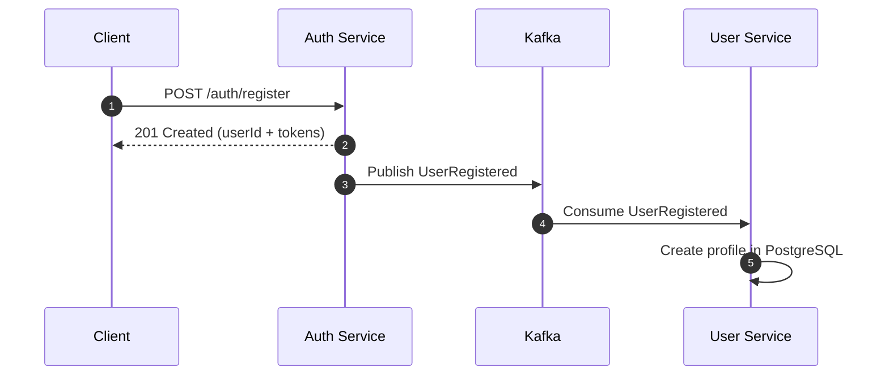

✅ Clear separation of concerns · Loose coupling via events · Easy to swap Auth for OAuth2/SSO

### 2. Login + Refresh Token Rotation

Short-lived access tokens + rotating refresh tokens stored in Redis for fast validation and revocation.

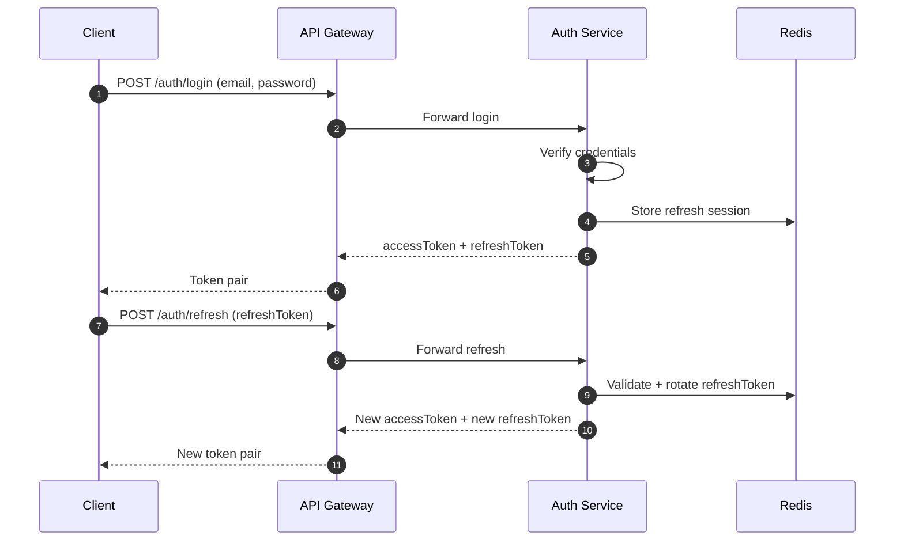

✅ Short-lived access tokens · Refresh rotation prevents replay · Redis-backed fast lookup & revocation

### 3. Booking End-to-End

Customer requests ride → Booking snapshots price → selects driver → Ride Service manages lifecycle.

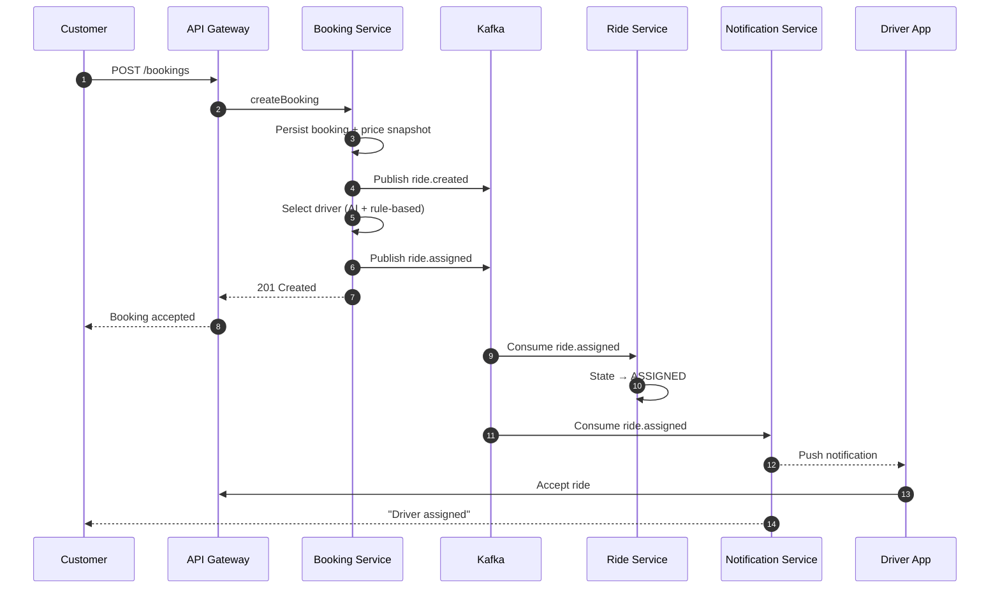

✅ Price snapshot ensures billing consistency · AI matching with rule-based fallback

### 4. Real-time GPS Tracking

Driver streams GPS via WebSocket → Ride Service updates Redis Geo → Passenger gets live position.

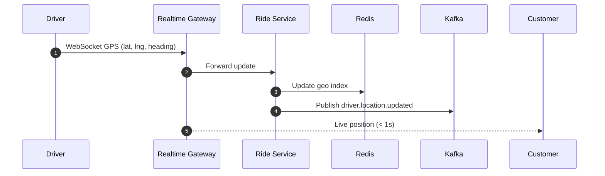

✅ Redis Geo for spatial queries · Kafka events for analytics/monitoring · WebSocket optimized for UI latency

### 5. AI Driver Matching

Redis Geo for spatial queries + feature scoring engine + rule-based fallback for reliability.

### 6. Payment Processing

Idempotent payment → PSP call (VietQR/PayOS) → retry with exponential backoff → Saga on failure.

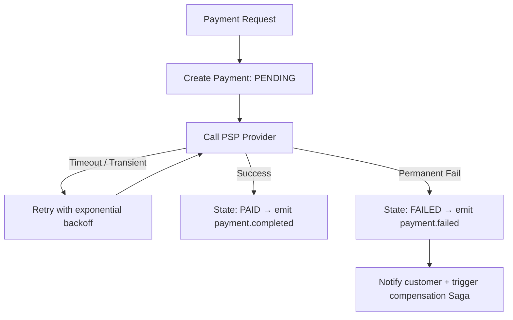

✅ Idempotency keys prevent double-charging · PSP-agnostic design · Event-driven state propagation

### 7. Payment Saga (Choreography)

No central orchestrator. Each service reacts to payment events independently — `payment.completed` triggers ride activation, `payment.failed` triggers booking compensation.

### 8. Surge Pricing

Pricing Service monitors demand/supply ratio in Redis → adjusts surge multiplier in near real-time → Booking snapshots price at creation time for billing consistency.

---

## 📨 Kafka Topics

| Topic | Producer | Consumers |
|-------|----------|-----------|
| `ride.created` | `booking-service` | `payment-service`, `ride-service` |
| `ride.assigned` | `ride-service` | `payment-service`, `ride-service` |
| `ride.cancelled` | `booking-service` | `payment-service`, `ride-service` |
| `driver.location.updated` | `ride-service` | — (analytics/monitoring) |
| `payment.completed` | `payment-service` | `ride-service` |
| `payment.failed` | `payment-service` | `ride-service` |
| `review.created` | `review-service` | — |

> Topics bootstrapped via `npm run kafka:topics:bootstrap`. Event schemas live in `contracts/events/`.

---

## 🚀 Quick Start

### Prerequisites

- **Docker Desktop** with Compose v2
- **Node.js 18+**

### 1. Start the full stack

```bash
git clone <repo-url> && cd cab-booking-system
npm run dev:infra
```

Launches 13 microservices + PostgreSQL, MongoDB, Redis, Kafka, Zookeeper.

### 2. Bootstrap Kafka topics

```bash
npm run kafka:topics:bootstrap
```

### 3. Seed demo data

```bash
npm run seed:all
```

### 4. Verify health

```bash
npm run health
```

### Useful Commands

| Command | Description |
|---------|-------------|
| `npm run dev:infra` | Start all services + infrastructure |
| `npm run dev:observability` | Start services + ELK + Grafana + Tempo + Prometheus |
| `npm run down:infra` | Stop and remove all containers & volumes |
| `npm run logs:kafka` | Tail Kafka logs |
| `npm run health` | Check API Gateway health (`http://localhost:3000/health`) |
| `npm run seed:all` | Seed demo data across all services |
| `npm run kafka:topics:bootstrap` | Create all required Kafka topics |
| `npm run test:level5` | Run test suite level 5 (cases 41–50) |
| `npm run test:level6` | Run test suite level 6 (cases 51–60) |
| `npm run contracts:events:validate` | Validate event schemas |
| `npm run contracts:events:compat` | Check backward compatibility of events |

### Developer Mode (single service)

```bash
npm run dev:infra    # Start infra only
cd services/auth-service
npm install
npm run dev          # Runs with nodemon on localhost
```

---

## 📈 Observability

| Component | Endpoint | Purpose |
|-----------|----------|---------|
| **Kibana** | `http://localhost:5601` | Log exploration & dashboards |
| **Elasticsearch** | `http://localhost:9200` | Log storage & indexing |
| **Grafana** | `http://localhost:3001` | Metrics + trace visualization |
| **Prometheus** | `http://localhost:9090` | Metrics collection |
| **Tempo** | `http://localhost:3200` | Distributed tracing backend |

### Data Flow

```
Logs:    Container stdout → Logstash → Elasticsearch → Kibana
Traces:  OpenTelemetry SDK → OTel Collector → Tempo → Grafana
Metrics: OpenTelemetry SDK → OTel Collector → Prometheus → Grafana
```

### Verification

```bash
curl -s http://localhost:9200/_cluster/health?pretty
curl -s http://localhost:9200/_cat/indices/cab-logs-*?v
curl -s "http://localhost:9200/cab-logs-*/_search?size=5&sort=@timestamp:desc"
```

> In Kibana: create data view `cab-logs-*` → filter by `service.name` and `level`.
>
> **Docker Desktop**: uses `host.docker.internal` for Logstash syslog forwarding.
> **Linux Docker Engine**: set `LOGSTASH_SYSLOG_HOST` to a reachable host/IP for Logstash port `5514`.

---

## 🔐 Security

| Layer | Mechanism |
|-------|-----------|
| **Edge** | TLS (HTTPS), rate limiting, Helmet headers |
| **Gateway** | JWT validation, RBAC enforcement, strict schema validation |
| **Service-to-Service** | Internal API keys, mTLS-ready architecture |
| **Sessions** | Short-lived access tokens + rotating refresh tokens (Redis-backed) |
| **Audit** | Login/refresh, payment events, permission changes logged centrally |

---

## 🛡️ Resilience

| Pattern | Implementation |
|---------|---------------|
| **Circuit Breaker** | Per-service circuit breakers at API Gateway with configurable thresholds |
| **Retry + Backoff** | Exponential backoff on Kafka consumers & HTTP clients |
| **Idempotency** | Idempotency keys on all payment & booking mutations |
| **Outbox Pattern** | Guaranteed event publication via transactional outbox |
| **Inbox Pattern** | Deduplicated event consumption via idempotent inbox |
| **Graceful Degradation** | Pricing fallback to cached rates, AI fallback to rule-based matching |

---

## 📄 License

MIT

---

<div align="center">
  <sub>Built for scalability, reliability, and developer experience.</sub>
</div>


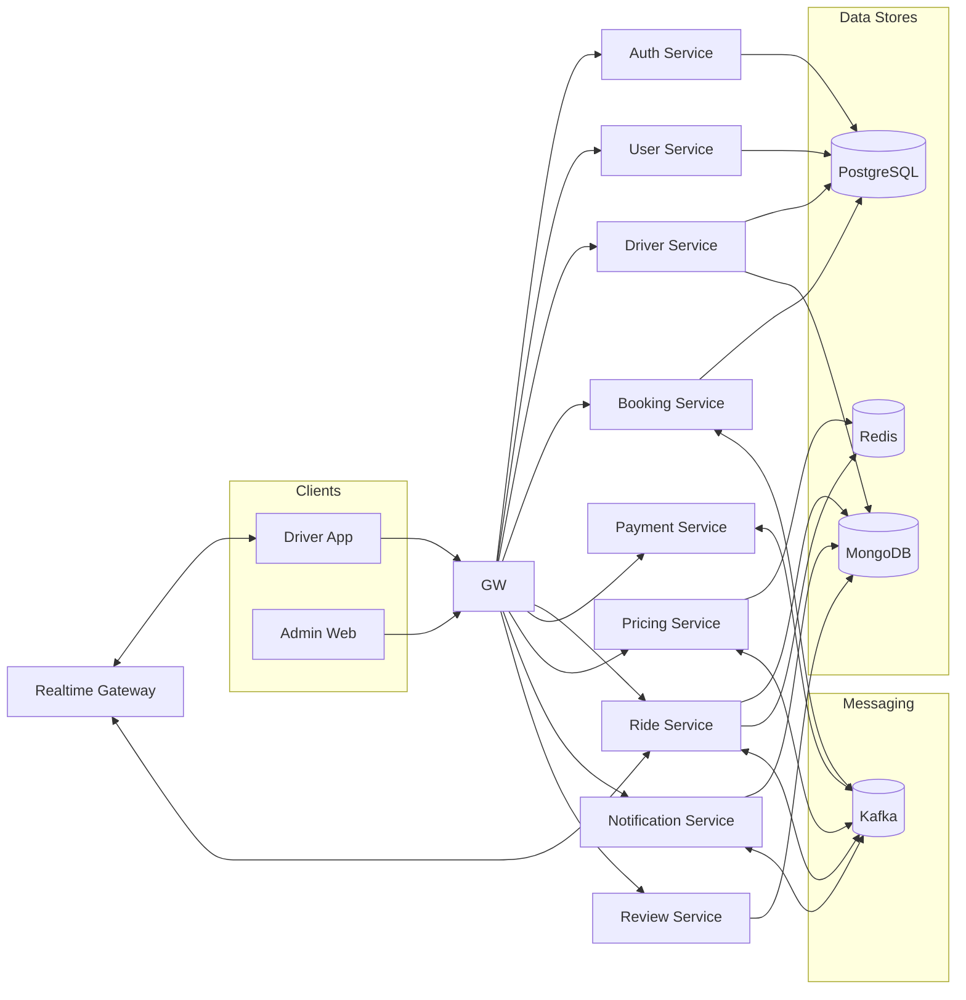

## 🏗️ Why this layout?

This architecture is intentionally split into clear layers to keep the platform **secure**, **scalable**, and **easy to evolve**.

- **API Gateway** acts as the _single entry point_ and enforces:
  - Authentication & authorization
  - Routing
  - Rate limiting / quotas
  - Request validation (schema, payload constraints)

- **Realtime Gateway** isolates WebSocket traffic so:
  - Real-time connections do not overload business services
  - Location streaming stays low-latency and independent

- **Microservices** follow:
  - **Database-per-service**
  - **Sync communication** via HTTP/REST (request-response)
  - **Async communication** via Events (Kafka/RabbitMQ) for decoupled workflows

---

## 🧩 Core Services

> Service names may vary in your repository. Keep this list aligned with `/services`.

| Service                  | Responsibility                                                    | Key Outputs / Notes                          |
| ------------------------ | ----------------------------------------------------------------- | -------------------------------------------- |
| **API Gateway**          | Entry point, routing, authZ/authN, rate limit, validation         | Protects all downstream services             |
| **Auth Service**         | Register/Login, JWT issuance, refresh token rotation, RBAC claims | Issues access/refresh tokens                 |
| **User Service**         | Customer profiles, preferences, ride history                      | Owns customer domain data                    |
| **Driver Service**       | Driver profile, KYC (optional), availability, vehicle, rating     | Owns driver domain data                      |
| **Booking Service**      | Creates ride requests, persists booking, snapshots price          | Emits `ride.created`                         |
| **Ride Service**         | Ride lifecycle state machine, ride status updates, coordination   | Consumes `ride.assigned`, manages states     |
| **Pricing Service**      | Fare estimation, surge multiplier, pricing consistency            | Provides quote + surge, snapshot per booking |
| **Payment Service**      | Payment execution, idempotency, retry/backoff, saga choreography  | Emits `payment.completed` / `payment.failed` |
| **Notification Service** | Push/SMS/email/in-app notifications                               | Consumes ride/payment events                 |
| **Review Service**       | Ratings & feedback after ride completion                          | Feeds quality + recommendation signals       |

---

## 🗄️ Data, Messaging, and Real-time Layer

| Component               | Technology     | Used For                                                        |
| ----------------------- | -------------- | --------------------------------------------------------------- |
| **Transactional DB**    | **PostgreSQL** | Auth / User / Driver / Booking / Ride data                      |
| **Document Store**      | **MongoDB**    | Notifications, Reviews, logs-like documents                     |
| **Hot Store + Geo**     | **Redis**      | Ride state cache, pricing metrics, Geo index for nearby queries |
| **Event Backbone**      | **Kafka**      | Async workflows, decoupling, eventual consistency               |
| **Real-time Transport** | **WebSocket**  | Driver GPS streaming & passenger live tracking                  |

---

## 🗂️ Repository Structure

| Folder       | What it Contains         | Typical Examples                                                    |
| ------------ | ------------------------ | ------------------------------------------------------------------- |
| `apps/`      | Frontend clients         | `driver-app/`, `admin-web/`                                         |
| `services/`  | Backend microservices    | `auth-service/`, `booking-service/`, `payment-service/`, `gateway/` |
| `contracts/` | API + event contracts    | OpenAPI specs, Kafka/RabbitMQ schemas                               |
| `libs/`      | Shared libraries         | logging, validation, HTTP clients, auth helpers                     |
| `infra/`     | Local/dev infrastructure | docker-compose, Kafka/Redis/Postgres configs                        |
| `scripts/`   | Automation helpers       | migrations, seeding, lint/test helpers                              |
| `docs/`      | Architecture & runbooks  | diagrams, ADRs, operational guides                                  |

This README follows the repository layout below.

```text
.
├── apps/                                # Frontend clients
│   ├── driver-app/                      # Driver UI (online/offline, accept rides, GPS)
│   └── admin-dashboard/                 # Admin/ops UI (monitoring, management, pricing)
│
├── services/                            # Backend microservices (domain-driven)
│   ├── api-gateway/                     # Entry point: auth, routing, rate limit, validation
│   ├── auth-service/                    # Register/login, JWT, refresh token rotation
│   ├── user-service/                    # Customer profiles, preferences, history
│   ├── driver-service/                  # Driver profile, availability, KYC (optional)
│   ├── booking-service/                 # Create booking, price snapshot, emit ride.created
│   ├── ride-service/                    # Ride lifecycle, state machine, ride status
│   ├── matching-service/                # AI matching + fallback rules, emit ride.assigned
│   ├── pricing-service/                 # Fare estimation, surge multiplier, zone pricing
│   ├── eta-service/                     # Event-driven ETA, cache-first, provider-agnostic
│   ├── payment-service/                 # Idempotent payments, retry/backoff, saga events
│   ├── notification-service/            # Push/SMS/email notifications from events
│   └── review-service/                  # Ratings & feedback after ride completion
│
├── contracts/                           # Contracts = single source of truth
│   ├── openapi/                         # REST specs (Swagger/OpenAPI)
│   │   ├── gateway.yaml
│   │   ├── booking.yaml
│   │   └── payment.yaml
│   ├── events/                          # Async event schemas (Kafka/RabbitMQ)
│   │   ├── ride.created.json
│   │   ├── ride.assigned.json
│   │   ├── driver.location.updated.json
│   │   ├── payment.completed.json
│   │   └── payment.failed.json
│   └── README.md                        # Contract versioning rules & conventions
│
├── libs/                                # Shared libraries (reused across services)
│   ├── common/                          # Shared utilities (helpers, constants, types)
│   ├── logger/                          # Structured logging + correlation IDs
│   ├── auth/                            # JWT helpers, RBAC/ABAC utilities, guards
│   ├── http-client/                     # Typed HTTP clients, retries, timeouts
│   ├── kafka/                           # Producer/consumer wrappers, serializers
│   ├── validation/                      # Request validation, schema utilities
│   └── observability/                   # Metrics/tracing helpers (OTEL, Prometheus)
│
├── infra/                               # Infrastructure for local/dev & production patterns
│   ├── docker/                          # Dockerfiles and runtime configs
│   ├── compose/                         # docker-compose files (kafka, redis, postgres...)
│   ├── kafka/                           # Broker config, topics, init scripts
│   ├── postgres/                        # Init scripts, migrations, seed data
│   ├── redis/                           # Redis config (geo index, cache policies)
│   ├── monitoring/                      # Prometheus/Grafana, dashboards
│   └── k8s/                             # Kubernetes manifests/Helm charts (optional)
│
├── scripts/                             # Developer utilities & automation
│   ├── bootstrap.sh                     # One-command setup (deps + infra)
│   ├── migrate.sh                       # Run DB migrations
│   ├── seed.sh                          # Seed demo/test data
│   ├── lint.sh                          # Lint runner
│   └── test.sh                          # Test runner
│
├── docs/                                # Documentation & decision records
│   ├── architecture/                    # High-level architecture docs + diagrams
│   ├── diagrams/                        # Mermaid/PNG architecture & sequence diagrams
│   ├── adr/                             # Architecture Decision Records
│   ├── runbooks/                        # Operational guides (incident response, SRE)
│   └── api/                             # API usage examples, Postman collections
│
├── package.json                         # Root scripts/workspaces
├── README.md                            # Project overview (this file)
└── LICENSE                              # License (if public)
```

## 🔄 System Flows

### 1) Registration → User Profile Creation (Event-driven)

**Goal:** Keep **Auth** isolated from business/profile data while ensuring user profiles are created **automatically** via events.

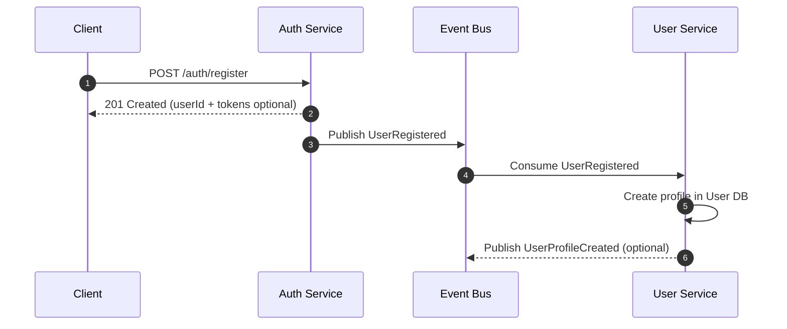

✅ Benefits

Clear separation of concerns:
Auth stores credentials only, while User Service owns profile/business data.

Loose coupling:
Services communicate via events → easier to evolve independently.

Future-proof identity:
Easy to replace Auth with OAuth2 / SSO without changing profile logic.

### 2) Login + Refresh Token Rotation (Enterprise Pattern)

**Goal:** Protect sessions using **short-lived access tokens** and **rotating refresh tokens** (reduces risk if a refresh token leaks).

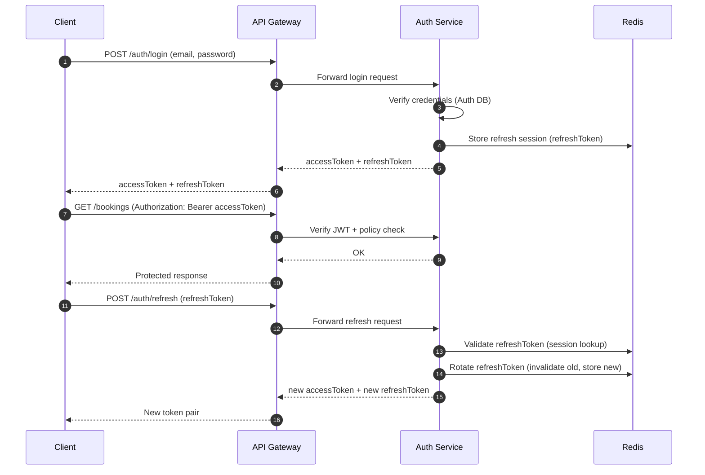

✅ Key points

Access Token is short-lived → limits damage if stolen.

Refresh Token Rotation invalidates the previous refresh token on each refresh → prevents replay.

Redis-backed sessions allow fast checks, revocation, and logout across devices.

Gateway enforcement keeps auth/policy verification consistent across all services.

### 3) Booking End-to-End (Create → Assign → Ride) — _No Separate Matching Service_

**Goal:** Keep the workflow **simple and consistent** by handling driver selection inside the **Booking Service** (no dedicated Matching microservice).

**High-level lifecycle**

1. Customer requests a ride.
2. Booking Service stores booking + **price snapshot**.
3. Booking Service selects a driver (rule-based / internal logic) and publishes `ride.assigned`.
4. Ride Service updates state; Notification Service pushes updates to Driver & Customer.

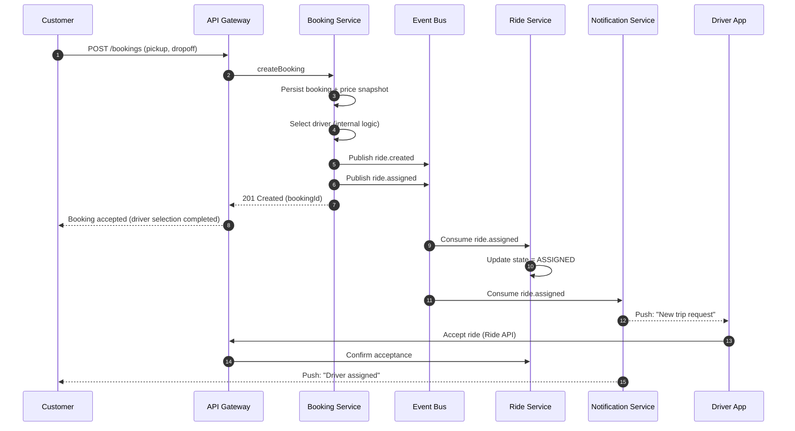

✅ Notes

Price snapshot guarantees billing consistency even if surge changes later.

Removing a separate Matching service reduces operational complexity for smaller systems.

You can later extract Matching into its own service if load/ML requirements grow (no contract change needed if you keep the same events).

### 4) Real-time GPS Update (Driver → Passenger) — _No ETA Service_

**Goal:** Deliver **near real-time** driver location updates to passengers via WebSocket, while still publishing events for **monitoring/analytics** (optional) without coupling them to the realtime channel.

**Flow summary**

- Driver streams GPS updates through **WebSocket** to the Realtime Gateway.
- Realtime Gateway forwards updates to **Ride Service**.
- Ride Service updates **Redis Geo** for fast geo queries and publishes `driver.location.updated`.
- Passenger receives live driver location updates via WebSocket.

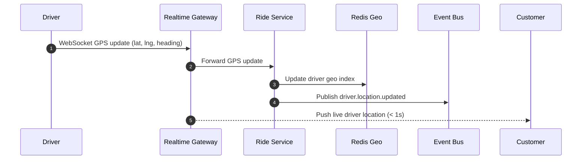

✅ Notes

Redis Geo supports fast geo queries (e.g., “drivers near pickup point”).

Events (driver.location.updated) let you plug in monitoring/analytics later without changing the realtime flow.

WebSocket is optimized for UI latency; Redis/Event Bus support scalability behind the scenes.

### 5) Payment Failure Handling + Retry

**Goal:** Payments must be **non-blocking** and resilient to **PSP latency/outages** while ensuring consistent state across services.

**Principles**

- **Retry with exponential backoff** on timeouts/transient failures
- **Payment Service = source of truth** (single authoritative payment state)
- **Event-driven updates** for eventual consistency across the platform
- **PSP-agnostic design** (easy to add/switch multiple PSP providers)

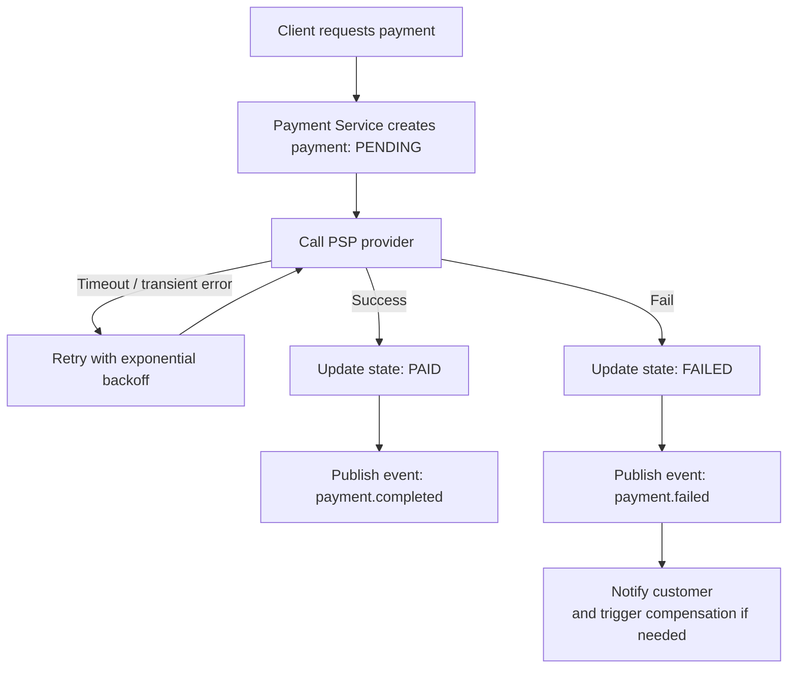

✅ Notes

Use an idempotency key per payment attempt to prevent double charging.

Treat timeouts as unknown outcomes → retry safely, then reconcile if needed.

Consumers (Ride/Booking/Notification/Wallet) should be idempotent when handling payment events.

---

## 📨 Kafka Topics & Event Schema

> Keep topics **domain-oriented**, use consistent naming, and ensure consumers are **idempotent**.

### Core Topics

| Topic                     | Producer        | Consumers                                                  |
| ------------------------- | --------------- | ---------------------------------------------------------- |
| `ride.created`            | Booking Service | _(Optional)_ internal booking handlers / future extensions |
| `ride.assigned`           | Booking Service | Notification Service, Ride Service                         |
| `driver.location.updated` | Ride Service    | _(Optional)_ Monitoring/Analytics                          |
| `payment.completed`       | Payment Service | Ride Service, _(Optional)_ Wallet/Ledger                   |
| `payment.failed`          | Payment Service | Notification Service                                       |

> ✅ Adjust consumers based on your actual implementation (you mentioned **no ETA** and **no separate Matching service**).

### Example Event Payload — `ride.created`

```json
{
  "eventId": "uuid",
  "type": "RideCreated",
  "rideId": "r123",
  "pickup": { "lat": 10.7, "lng": 106.6 },
  "timestamp": "2025-01-01T10:00:00Z"
}
```

Recommended event fields

eventId: unique UUID (supports deduplication)

type: event type name (stable contract)

timestamp: ISO-8601 time for ordering/debug

data (optional): nested object for payload versioning

---

## 🧰 Installation & Running Locally

### ✅ Prerequisites

- **Docker** + **Docker Compose**
- **Node.js 18+** (npm included)

### 1) Start infrastructure & services (Docker Compose)

From the repository root (or `infra/` depending on your setup):

```bash
docker compose up --build
This typically starts:

API Gateway

Core services (auth, booking, ride, payment, notification, …)

Kafka (or RabbitMQ)

PostgreSQL

Redis

(Optional) MongoDB

💡 Tip: follow logs to confirm everything is healthy:

docker compose logs -f
2) Verify the system
Endpoints (examples)

API Gateway: http://localhost:3000

Auth Service: http://localhost:3001

Example — Register a user

curl -X POST http://localhost:3001/auth/register \
  -H "Content-Type: application/json" \
  -d '{"email":"test@mail.com","password":"123456"}'
3) Developer mode (run a single service)
Run infrastructure in Docker, run one service locally for faster iteration:

cd services/auth-service
npm install
npm run dev
⚙️ Configuration
Each service should have its own .env.

Example — services/auth-service/.env

PORT=3001

DB_HOST=postgres
DB_NAME=auth_db
DB_USER=postgres
DB_PASSWORD=postgres

JWT_SECRET=super_secret_key
JWT_EXPIRES_IN=15m
REFRESH_TOKEN_EXPIRES_IN=7d
Best practices
🔒 Never commit secrets → use .env.example + secrets manager in production

🧱 Database-per-service → avoid cross-service DB coupling

🧩 Standardize env naming → DB_*, REDIS_URL, KAFKA_BROKERS, etc.

🔐 Security Notes (Zero Trust)
Never trust, always verify.

Edge security: TLS, WAF protections, rate limiting

API Gateway (Policy Enforcement Point):

JWT/OAuth2 validation

RBAC/ABAC permission checks

Quotas + strict schema validation

Service-to-service security: mTLS, service identity (service-mesh ready)

IAM best practices: short-lived access tokens + refresh rotation/revocation (Redis session store)

Audit logging: login/refresh, payments, permission changes

🛡️ Resilience & Failure Handling
Recommended patterns

Circuit breaker

Retry + exponential backoff

Bulkhead isolation

Idempotency keys (especially payments)

Eventual consistency

Graceful degradation (fallback strategies)

Common failure examples

WebSocket disconnect → auto-reconnect, fallback polling

Payment PSP timeout → retry/backoff; provider down → failover strategy

Kafka lag → scale consumers; tune partitions
```

\

## 📈 Observability (ELK logging + OTel metrics/tracing)

### Run full stack (services + observability)

```bash
npm run dev:observability
```

This uses:

- Base services: `infra/docker-compose.dev.yml`
- Observability overlay: `infra/observability/docker-compose.observability.yml`

### Endpoints

- Kibana (logs): http://localhost:5601
- Elasticsearch: http://localhost:9200
- Logstash API: http://localhost:9600
- Grafana (metrics + traces): http://localhost:3001
- Prometheus: http://localhost:9090
- Tempo: http://localhost:3200

### Logging path

- Primary logging path: `Container stdout/stderr -> Logstash -> Elasticsearch -> Kibana`
- Tracing path: `OpenTelemetry -> OTEL Collector -> Tempo -> Grafana`
- Metrics path: `OpenTelemetry -> OTEL Collector -> Prometheus -> Grafana`

### Quick verification

```bash
curl -s http://localhost:9200/_cluster/health?pretty
curl -s http://localhost:9200/_cat/indices/cab-logs-*?v
curl -s "http://localhost:9200/cab-logs-*/_search?size=5&sort=@timestamp:desc"
```

Open Kibana, create data view `cab-logs-*`, then filter by `service.name` and `level`.

### Notes

- Loki is deprecated from the active logging path.
- Grafana is kept for metrics/traces only.
- See migration details in `docs/observability/ELK_MIGRATION_NOTES.md`.
- Docker Desktop default for syslog forwarding is `LOGSTASH_SYSLOG_HOST=host.docker.internal`.
  On Linux Docker Engine, set `LOGSTASH_SYSLOG_HOST` to a reachable host/IP for Logstash port `5514`.
