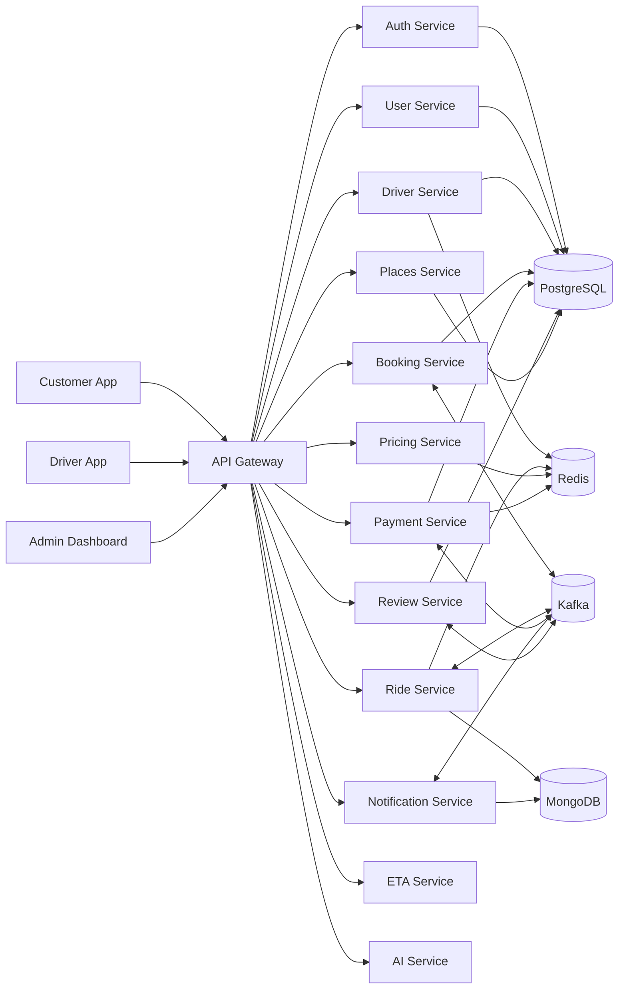

# Cab Booking System — Repository Summary

## Tổng quan

`cab-booking-system` là một hệ thống đặt xe theo kiến trúc microservices, gồm ứng dụng khách hàng, ứng dụng tài xế, dashboard quản trị, API Gateway, nhiều service backend theo domain, hợp đồng OpenAPI/event contract, hạ tầng local bằng Docker Compose và bộ quan sát hệ thống bằng ELK/OpenTelemetry/Prometheus/Grafana.

Mục tiêu chính của hệ thống:

- Đặt xe và quản lý vòng đời chuyến đi theo thời gian gần thực.
- Tách domain rõ ràng theo microservice: auth, user, driver, booking, ride, pricing, payment, notification, review, places, ETA và AI.
- Giao tiếp đồng bộ qua HTTP/REST và bất đồng bộ qua Kafka.
- Đảm bảo reliability bằng idempotency, outbox/inbox, retry, DLQ và compensation cho các luồng phân tán.
- Hỗ trợ observability với logging, metrics, tracing và dashboard.
- Có contract governance cho REST API và Kafka events.

## Cách dùng tài liệu này khi bắt đầu phiên LLM mới

Tài liệu này được viết như một “từ điển dự án” để một LLM/agent mới có thể đọc trước khi code. Khi bắt đầu phiên làm việc mới, hãy đưa yêu cầu như sau:

```text
Hãy đọc `docs/README.md` trước. Đây là từ điển dự án. Sau đó đọc thêm các file liên quan đến task rồi mới chỉnh code.
```

Quy tắc onboarding nhanh cho LLM khác:

1. Đọc phần **Tổng quan**, **Cấu trúc thư mục**, **Backend services**, **Frontend apps** để hiểu domain.
2. Nếu task liên quan API, đọc `contracts/openapi/*.yaml`, `docs/openapi/api-inventory.md` và route/controller của service tương ứng.
3. Nếu task liên quan Kafka/event, đọc `contracts/events/catalog.json`, schema trong `contracts/events/schema-registry/`, rồi đọc producer/consumer trong service.
4. Nếu task liên quan database, đọc `migrations/`, repository/db layer của service, sau đó mới sửa controller/service logic.
5. Nếu task liên quan mobile/web UI, đọc màn hình trong `apps/*/src/screens` hoặc route trong `apps/driver-app/app`, rồi đọc service API client tương ứng.
6. Sau khi sửa code, chạy test/lint phù hợp với đúng workspace/service thay vì chạy toàn bộ repo nếu không cần.

## Công nghệ chính

| Nhóm | Công nghệ |
| --- | --- |
| Backend | Node.js, Express |
| Mobile app | React Native, Expo |
| Web admin | React, Vite |
| Database | PostgreSQL, MongoDB |
| Cache/Geo/Idempotency | Redis |
| Messaging | Kafka, Zookeeper |
| API contracts | OpenAPI YAML |
| Event contracts | JSON Schema, schema registry nội bộ |
| Observability | OpenTelemetry, Prometheus, Tempo, Grafana, Elasticsearch, Logstash, Kibana |
| Infra local | Docker Compose |
| Testing | Jest, shell test suites, Postman collections |
| Monorepo | npm workspaces |

## Cấu trúc thư mục

```text
.
├── apps/                    # Frontend clients
│   ├── admin-dashboard/      # Web dashboard cho admin/operations
│   ├── customer-app/         # Mobile/web app cho khách hàng
│   └── driver-app/           # Mobile/web app cho tài xế
├── services/                # Backend microservices
│   ├── api-gateway/
│   ├── auth-service/
│   ├── user-service/
│   ├── driver-service/
│   ├── booking-service/
│   ├── ride-service/
│   ├── pricing-service/
│   ├── payment-service/
│   ├── notification-service/
│   ├── review-service/
│   ├── places-service/
│   ├── eta-service/
│   └── ai-service/
├── libs/                    # Shared libraries dùng lại giữa services/apps
│   ├── http/
│   ├── kafka/
│   ├── observability/
│   ├── resilience/
│   ├── security/
│   ├── types/
│   └── validation/
├── contracts/               # Hợp đồng API và event
│   ├── openapi/
│   ├── events/
│   └── state-machines/
├── infra/                   # Docker Compose, DB init, Kafka, observability
├── scripts/                 # Script seed, healthcheck, test, contract tooling
└── docs/                    # Tài liệu kiến trúc, OpenAPI, runbook, sequence diagram
```

## Kiến trúc tổng thể

Hệ thống đi theo mô hình microservices/event-driven:

1. Client gọi vào `api-gateway`.
2. Gateway xác thực, định tuyến và proxy request đến service tương ứng.
3. Các service xử lý nghiệp vụ riêng, sở hữu database/cache riêng theo domain.
4. Các workflow phân tán dùng Kafka event để giảm coupling.
5. Các service quan trọng dùng outbox/inbox/idempotency để xử lý event an toàn.
6. Observability thu thập log, metric, trace từ service/container.



## Các ứng dụng frontend

### `apps/customer-app`

Ứng dụng React Native/Expo cho khách hàng. Các màn hình và module chính gồm:

- Đăng nhập, OTP, splash/auth flow.
- Trang bản đồ, tìm điểm đến, địa điểm đã lưu/gần đây.
- Chọn loại xe, xem báo giá, breakdown giá.
- Tìm tài xế, theo dõi chuyến đi, live route/map.
- Thanh toán, ví, phương thức thanh toán.
- Lịch sử chuyến đi, đánh giá, hồ sơ và cài đặt.
- Có mock layer để phát triển UI khi backend chưa sẵn sàng.

Script đáng chú ý:

- `npm run start --workspace customer-app`
- `npm run android --workspace customer-app`
- `npm run ios --workspace customer-app`
- `npm run web --workspace customer-app`

### `apps/driver-app`

Ứng dụng React Native/Expo Router cho tài xế. Các module chính gồm:

- Đăng nhập và context xác thực.
- Bật/tắt trạng thái online.
- Nhận yêu cầu chuyến đi, accept/decline.
- Điều hướng/chạy chuyến, cập nhật vị trí.
- Lịch sử chuyến, ví/thu nhập, profile.
- Tích hợp routing providers như OSRM, ORS, Google, Mapbox.

Script đáng chú ý:

- `npm run start --workspace driver-app`
- `npm run android --workspace driver-app`
- `npm run ios --workspace driver-app`
- `npm run web --workspace driver-app`

### `apps/admin-dashboard`

Dashboard React/Vite cho admin và vận hành. Các màn hình chính gồm:

- Dashboard KPI.
- Quản lý users, drivers, rides, payments.
- Pricing/surge rule management và pricing simulator.
- Monitoring/live map/live counters.
- Logs audit và audit table.
- Login/admin auth flow.

Script đáng chú ý:

- `npm run dev --workspace apps-admin-dashboard`
- `npm run build --workspace apps-admin-dashboard`
- `npm run lint --workspace apps-admin-dashboard`

## Các backend services

| Service | Trách nhiệm chính | Port local trong compose |
| --- | --- | --- |
| `api-gateway` | Entry point, proxy, auth middleware, rate limit, circuit breaker, health endpoints | `3000`, HTTPS `3443` |
| `auth-service` | Register/login, JWT, refresh/logout/verify, credential store | `4001` |
| `user-service` | Hồ sơ người dùng, endpoint public/internal cho user profile | `4004` |
| `driver-service` | Driver profile, vehicle, online/offline, GPS location, admin driver operations, internal availability APIs | `3011` |
| `booking-service` | Tạo/cancel booking, price snapshot, idempotency, publish/consume ride/payment events | `3003` |
| `ride-service` | Ride lifecycle/state machine, assignment, status update, Kafka inbox/outbox, Redis/Mongo state | `3005` |
| `pricing-service` | Quote, finalize quote, rate/surge/coupon logic, Redis cache | `3006` |
| `payment-service` | Payment lifecycle, VietQR/PayOS integration, idempotency, wallet/withdrawals, outbox/inbox, compensation | `3007` |
| `notification-service` | Notification CRUD/batch/retry/preferences, dispatcher/provider abstraction | `3010` |
| `review-service` | Review lifecycle, rating/tip, idempotency, state machine | `3009` |
| `places-service` | Autocomplete/recent places, local catalog/Nominatim provider, PostgreSQL storage | `3014` |
| `eta-service` | ETA estimation endpoint | `3012` |
| `ai-service` | Fraud, forecast, drift, recommendation, agent/model runtime helpers | `3013` |

## Từ điển service backend cho LLM

Hầu hết service Node.js/Express trong `services/*` có cấu trúc tương tự. Khi cần chỉnh một service, hãy ưu tiên đọc theo thứ tự này:

1. `package.json`: script, dependency, tên workspace.
2. `src/config.js` hoặc `src/config/*`: biến môi trường và default config.
3. `src/app.js`: khai báo middleware, route mount, error handler.
4. `src/server.js`: bootstrap HTTP server, DB connection, consumer/poller nếu có.
5. `src/routes/*.js`: định nghĩa URL và middleware theo endpoint.
6. `src/controllers/*.js`: nhận request/response, validate input ở tầng HTTP.
7. `src/services/*.js` hoặc `src/domain/*.js`: nghiệp vụ chính, state machine, orchestration.
8. `src/repository/*.js`, `src/repositories/*.js`, `src/db/*.js`: truy cập PostgreSQL/Mongo/Redis.
9. `src/messaging/*.js`: Kafka producer/consumer/outbox/inbox/schema registry.
10. `migrations/*.sql` hoặc `src/db/migrations/*.sql`: schema database.
11. `test/*.test.js`: ví dụ hành vi mong muốn và regression tests.

### `services/api-gateway`

Dùng khi task liên quan routing, bảo mật edge, proxy, timeout/retry/circuit breaker.

File/thư mục quan trọng:

- `src/app.js`: app Express chính, mount middleware và proxy routes.
- `src/server.js`: bootstrap gateway.
- `src/config/services.js`: mapping upstream service URL.
- `src/config/security.js`: config security/gateway.
- `src/proxy/proxyRequest.js`: logic proxy request đến service đích.
- `src/proxy/circuitBreaker.js`: circuit breaker cho downstream.
- `src/middleware/auth.js`: xác thực JWT ở gateway.
- `src/middleware/rateLimit.js`: rate limiting.
- `src/middleware/requestLogger.js`, `src/middleware/trace.js`: logging/tracing.
- `test/proxy.test.js`: test proxy behavior.

### `services/auth-service`

Dùng khi task liên quan đăng ký, đăng nhập, JWT, refresh token, logout, token verify.

File/thư mục quan trọng:

- `src/routes/auth.js`: auth endpoints.
- `src/repository/userRepository.js`: credential/user lookup trong PostgreSQL.
- `src/repository/tokenRepository.js`: refresh token/session persistence.
- `src/utils/security.js`: hash/verify password và helper bảo mật.
- `src/utils/revokedAccessTokenStore.js`: revoke access token.
- `migrations/001_init.sql`, `migrations/002_align_user_ids_to_char8.sql`: schema auth.
- `README.md`: mô tả riêng auth-service.

### `services/user-service`

Dùng khi task liên quan hồ sơ khách hàng/user, internal user lookup, user metadata.

File/thư mục quan trọng:

- `src/routes/users.js`: public user APIs.
- `src/routes/internal.js`: internal APIs gọi bởi service khác.
- `src/controllers/userController.js`: request handler cho user.
- `src/repository/userRepository.js`: user persistence.
- `src/repository/outboxRepository.js`: outbox nếu user event cần publish.
- `src/messaging/publisher.js`, `src/messaging/topics.js`: event publishing.
- `src/middleware/internalAuth.js`: bảo vệ internal endpoint bằng internal API key.
- `migrations/*.sql`: schema/index/user id alignment.

### `services/driver-service`

Dùng khi task liên quan tài xế, xe, KYC, trạng thái online/offline, vị trí tài xế, admin quản lý driver.

File/thư mục quan trọng:

- `src/routes/driver.js`: driver-facing APIs.
- `src/routes/admin.js`: admin APIs cho driver.
- `src/routes/internal.js`: APIs nội bộ như availability/location lookup.
- `src/services/driverService.js`: nghiệp vụ driver.
- `src/domain/driverState.js`: trạng thái driver.
- `src/repository/driverRepository.js`: driver profile.
- `src/repository/locationRepository.js`: location/GPS persistence.
- `src/repository/vehicleRepository.js`: vehicle data.
- `src/repository/kycRepository.js`: KYC data.
- `src/cache/redis.js`, `src/utils/redisKeys.js`: Redis hot state/geo keys.
- `src/utils/identity.js`, `src/utils/mapper.js`: identity mapping và DTO mapping.
- `migrations/*.sql`: driver, vehicle, KYC schema.
- `test/driverRoutes.test.js`, `test/driverState.test.js`: behavior tests.

### `services/booking-service`

Dùng khi task liên quan tạo booking, cancel booking, booking idempotency, price snapshot, interaction với pricing/payment/ride/driver/notification/AI.

File/thư mục quan trọng:

- `src/routes/bookings.js`: booking endpoints.
- `src/schemas/bookingSchemas.js`: request validation schemas.
- `src/repositories/bookingRepo.js`: booking persistence.
- `src/repositories/idempotencyRepo.js`: idempotency key store.
- `src/repositories/outboxRepo.js`, `src/repositories/inboxRepo.js`: outbox/inbox tables.
- `src/messaging/producer.js`: publish ride/payment events.
- `src/messaging/consumer.js`: consume payment events.
- `src/messaging/outboxPublisher.js`: background outbox publishing.
- `src/messaging/schemaRegistry.js`: validate event schema.
- `src/clients/pricingClient.js`: gọi pricing-service.
- `src/clients/paymentClient.js`: gọi payment-service.
- `src/clients/rideClient.js`: gọi ride-service.
- `src/clients/driverClient.js`: gọi driver-service.
- `src/clients/etaClient.js`, `src/clients/aiClient.js`, `src/clients/notificationClient.js`: dependency clients.
- `src/clients/dependencyCircuitBreaker.js`: circuit breaker cho dependency.
- `migrations/*.sql`: booking schema, idempotency, consistency, indexes.
- `test/bookings.p0.integration.test.js`, `test/consumer.payment-events.test.js`, `test/outboxPublisher.ordering.test.js`: test quan trọng.

### `services/ride-service`

Dùng khi task liên quan vòng đời chuyến đi, assign driver, accept/start/complete/cancel ride, driver location event, inbox/outbox Kafka.

File/thư mục quan trọng:

- `src/routes/rides.js`: ride endpoints.
- `src/domain/rideStateMachine.js`: state machine chính của ride.
- `src/repository/rideRepository.js`: ride persistence.
- `src/repository/idempotencyRepository.js`: idempotency store.
- `src/repository/outboxEventsRepository.js`: outbox events.
- `src/repository/inboxEventsRepository.js`: inbox events.
- `src/messaging/producer.js`: publish ride events.
- `src/messaging/consumer.js`: consume ride/payment events.
- `src/messaging/outboxPoller.js`: publish outbox định kỳ.
- `src/messaging/inboxProcessor.js`: xử lý inbox event.
- `src/messaging/schemaRegistry.js`: validate event schema.
- `src/cache/redis.js`: Redis cache/geo/hot state.
- `src/db/mongo.js`: MongoDB connection.
- `migrations/*.sql`: schema relational phụ trợ cho idempotency/outbox/inbox.
- `docs/db-design.md`: thiết kế DB riêng của ride-service.
- `test/rides.transitions.test.js`, `test/rideStateMachine.test.js`, `test/routes.integration.test.js`: test state/route quan trọng.

### `services/pricing-service`

Dùng khi task liên quan báo giá, surge, coupon, finalize quote, pricing simulator/admin pricing.

File/thư mục quan trọng:

- `src/routes/pricing.js`: pricing endpoints.
- `src/domain/pricingEngine.js`: công thức tính giá.
- `src/config/rates.js`: rate config/default.
- `src/repository/rateRepository.js`: rate persistence/source.
- `src/repository/surgeRuleRepository.js`: surge rule storage.
- `src/repository/quoteRepository.js`: quote persistence/cache.
- `src/cache/redis.js`: Redis cache cho pricing.
- `test/pricingEngine.test.js`: test công thức giá.
- `README.md`: mô tả riêng pricing-service.

### `services/payment-service`

Dùng khi task liên quan payment, QR, PayOS/VietQR, wallet, withdrawal, payment webhook, idempotency, saga/compensation.

File/thư mục quan trọng:

- `src/routes/payments.js`: payment APIs.
- `src/routes/webhooks.js`: PayOS/webhook endpoints.
- `src/controllers/paymentsController.js`: payment request handlers.
- `src/controllers/payosWebhookController.js`: webhook handler.
- `src/domain/paymentStatus.js`: payment state/status constants.
- `src/services/paymentService.js`: nghiệp vụ payment chính.
- `src/services/vietqrService.js`: tạo VietQR.
- `src/services/payosService.js`, `src/services/payosWebhookService.js`, `src/services/payosAutoSyncService.js`: PayOS flow.
- `src/services/walletService.js`: wallet operations.
- `src/services/idempotencyService.js`: idempotency nghiệp vụ.
- `src/integrations/vietqrClient.js`, `src/integrations/payosClient.js`: external payment clients.
- `src/repositories/paymentsRepo.js`: payment persistence.
- `src/repositories/withdrawalsRepo.js`: withdrawal persistence.
- `src/repositories/idempotencyRepo.js`, `src/db/idempotency.js`: idempotency persistence.
- `src/repositories/outboxRepo.js`, `src/repositories/inboxRepo.js`, `src/db/outbox.js`, `src/db/inbox.js`: outbox/inbox.
- `src/messaging/consumer.js`: consume ride events.
- `src/messaging/outboxPublisher.js`: publish payment events.
- `src/messaging/dlq.js`: dead-letter handling.
- `src/messaging/schemaRegistry.js`, `src/messaging/events.js`, `src/messaging/topics.js`: Kafka contract/event definitions.
- `migrations/*.sql`, `src/db/migrations/*.sql`, `src/db/schema.sql`: schema payment.
- `test/routes/payments.test.js`, `test/paymentService.test.js`, `test/dlq.test.js`, `test/contract.kafka.*.test.js`: test quan trọng.

### `services/notification-service`

Dùng khi task liên quan notification, user preference, push/SMS/email/in-app, retry/dedupe.

File/thư mục quan trọng:

- `src/routes/notifications.js`: notification APIs.
- `src/routes/users.js`: preference/user notification APIs.
- `src/services/notificationService.js`: nghiệp vụ notification.
- `src/dispatcher/notificationDispatcher.js`: dispatch notification.
- `src/providers/index.js`: provider abstraction.
- `src/repository/notificationRepository.js`: notification storage.
- `src/repository/preferenceRepository.js`: user preferences.
- `src/db/mongo.js`: MongoDB connection.
- `src/utils/dedupe.js`: chống duplicate notification.
- `src/messaging/topics.js`: topic names.
- `README.md`: mô tả riêng notification-service.

### `services/review-service`

Dùng khi task liên quan đánh giá chuyến đi, rating, feedback, tip, review state/idempotency.

File/thư mục quan trọng:

- `src/routes/reviews.js`: review endpoints.
- `src/domain/reviewStateMachine.js`: trạng thái review.
- `src/repository/reviewRepository.js`: review persistence.
- `src/repository/idempotencyRepository.js`: idempotency store.
- `src/idempotency/store.js`: idempotency helper.
- `src/db/ensureSchema.js`: ensure schema khi chạy.
- `migrations/*.sql`: review schema, tip, indexes, identity alignment.
- `test/routes.integration.test.js`, `test/reviewStateMachine.test.js`, `test/reviews.idempotency.test.js`, `test/contract.test.js`: test quan trọng.

### `services/places-service`

Dùng khi task liên quan search/autocomplete địa điểm, recent destinations, catalog địa điểm local, Nominatim provider.

File/thư mục quan trọng:

- `src/routes/places.js`: places endpoints.
- `src/services/searchService.js`: search orchestration.
- `src/providers/localCatalogProvider.js`: provider dựa trên catalog local.
- `src/providers/nominatimProvider.js`: provider Nominatim.
- `src/repositories/recentRepository.js`: recent places persistence.
- `src/data/catalog.js`: dữ liệu catalog địa điểm local.
- `src/db/pool.js`, `src/db/init.js`: PostgreSQL pool/init.
- `src/utils/normalize.js`, `src/utils/http.js`: normalize và HTTP helpers.
- `test/app.test.js`: app tests.
- `explanation-for-place-service.txt`: ghi chú riêng về places-service.

### `services/eta-service`

Dùng khi task liên quan ước tính thời gian đến/ETA.

File/thư mục quan trọng:

- `src/app.js`: app Express ETA.
- `src/server.js`: bootstrap server.
- `src/monitoring.js`: monitoring endpoint/metrics.
- `package.json`: scripts/dependencies.

### `services/ai-service`

Dùng khi task liên quan fraud detection, forecast, drift, recommendation, agent/model runtime.

File/thư mục quan trọng:

- `src/routes/ai.js`: AI endpoints.
- `src/services/fraudService.js`: fraud/risk scoring.
- `src/services/forecastService.js`: forecasting.
- `src/services/driftService.js`: drift detection.
- `src/services/recommendationService.js`: recommendation.
- `src/services/agentService.js`: agent orchestration.
- `src/services/modelRuntime.js`: model runtime abstraction.
- `src/services/toolClients.js`: external/internal tool clients.
- `src/services/decisionLogger.js`: log quyết định AI.
- `src/config/agent-config.json`, `src/config/drift-baseline.json`: cấu hình AI.
- `test/*.test.js`: AI service tests.
- `README.md`: mô tả riêng ai-service.

## Từ điển frontend cho LLM

### Customer app — `apps/customer-app`

Khi sửa Customer App, đọc theo thứ tự:

1. `App.tsx`, `index.js`: bootstrap app.
2. `src/navigation/RootNavigator.tsx`, `src/navigation/AuthStack.tsx`, `src/navigation/MainStack.tsx`, `src/navigation/Tabs.tsx`: navigation flow.
3. `src/screens/auth/*`: login/OTP/splash.
4. `src/screens/customer/*`: màn hình nghiệp vụ customer.
5. `src/components/common/*`: component UI dùng chung như button, input, card, bottom sheet, skeleton.
6. `src/components/customer/*`: component domain customer như ride card, price breakdown, driver info, rating stars.
7. `src/components/map/*`: map/live route/location components.
8. `src/services/*Api.ts`: API clients gọi backend/gateway.
9. `src/lib/api.ts`, `src/lib/endpoints.ts`, `src/lib/config.ts`: base URL, config, HTTP wrapper.
10. `src/lib/token-store.ts`: token persistence.
11. `src/store/customerStore.tsx`: app/customer state.
12. `src/mocks/*`: mock handlers/state/factories khi phát triển không cần backend thật.
13. `src/theme/*`: token, palette, style dùng chung.

Mapping nhanh theo feature:

| Feature | Nên đọc/sửa file |
| --- | --- |
| Login/OTP | `src/screens/auth/LoginScreen.tsx`, `src/screens/auth/OtpScreen.tsx`, `src/services/authApi.ts`, `src/lib/token-store.ts` |
| Home map/destination | `src/screens/customer/HomeMapScreen.tsx`, `DestinationScreen.tsx`, `src/components/customer/LocationSearch.tsx`, `src/services/placeApi.ts` |
| Quote/ride option | `RideOptionsScreen.tsx`, `RideOptionCard.tsx`, `PriceBreakdownModal.tsx`, `pricingApi.ts`, `bookingApi.ts` |
| Searching/track ride | `SearchingDriverScreen.tsx`, `RideTrackingScreen.tsx`, `LiveRouteMap.tsx`, `rideApi.ts`, `driverApi.ts`, `useRealtimeStream.ts` |
| Payment/wallet | `PaymentScreen.tsx`, `PaymentMethodsScreen.tsx`, `WalletScreen.tsx`, `ProfileWalletScreen.tsx`, `paymentApi.ts` |
| Review/rating | `RatingScreen.tsx`, `RatingStars.tsx`, `reviewApi.ts` |
| Mock mode | `src/mocks/config.ts`, `src/mocks/handlers/*`, `src/mocks/state/db.ts`, `src/services/mockApi.ts` |

### Driver app — `apps/driver-app`

Driver App dùng Expo Router. Khi sửa, đọc theo thứ tự:

1. `app/_layout.tsx`: root layout/providers.
2. `app/login.tsx`: login screen.
3. `app/(tabs)/_layout.tsx`: tab navigation.
4. `app/(tabs)/index.tsx`: home/dashboard tài xế.
5. `app/(tabs)/requests.tsx`, `requests.native.tsx`: danh sách yêu cầu chuyến.
6. `app/(tabs)/history.tsx`, `wallet.tsx`, `profile.tsx`: tab phụ.
7. `app/ride/_layout.tsx`, `app/ride/navigation.tsx`, `app/ride/complete.tsx`: ride flow.
8. `lib/contexts/auth.tsx`, `lib/contexts/driver.tsx`, `lib/contexts/ride.tsx`: global context.
9. `hooks/use-driver-online.ts`, `use-incoming-rides.ts`, `use-ride.ts`, `use-ride-tracking.ts`, `use-route-polyline.ts`: business hooks.
10. `lib/services/*.ts`, `src/services/*Api.ts`: API clients.
11. `src/services/routing/*`: routing provider abstraction.
12. `components/ui/*`, `constants/theme.ts`, `lib/theme.ts`: UI/theme.
13. `lib/config.ts`, `lib/endpoints.ts`, `lib/token-store.ts`: config/token.

Mapping nhanh theo feature:

| Feature | Nên đọc/sửa file |
| --- | --- |
| Driver login | `app/login.tsx`, `lib/services/auth.ts`, `lib/contexts/auth.tsx`, `lib/token-store.ts` |
| Online/offline | `hooks/use-driver-online.ts`, `lib/contexts/driver.tsx`, `lib/services/driver.ts`, `src/services/driverApi.ts` |
| Incoming rides | `app/(tabs)/requests.tsx`, `hooks/use-incoming-rides.ts`, `hooks/use-incoming-ride.ts`, `lib/services/ride.ts` |
| Ride navigation/tracking | `app/ride/navigation.tsx`, `hooks/use-ride-tracking.ts`, `hooks/use-route-polyline.ts`, `src/services/routing/*` |
| Wallet/earnings | `app/(tabs)/wallet.tsx`, `hooks/use-earnings.ts`, `lib/services/payment.ts` |
| Theme/UI | `components/ui/*`, `constants/theme.ts`, `lib/theme.ts` |

### Admin dashboard — `apps/admin-dashboard`

Admin Dashboard dùng React/Vite. Khi sửa, đọc theo thứ tự:

1. `src/main.jsx`: bootstrap React.
2. `src/app/App.jsx`, `src/app/providers.jsx`: app shell/providers.
3. `src/routes/AppRoutes.jsx`: routing.
4. `src/context/AuthContext.jsx`, `src/hooks/useAuth.js`: auth state.
5. `src/components/layout/*`: sidebar/header/layout.
6. `src/pages/admin/*`: page theo domain.
7. `src/components/admin/*`: table/detail/form/domain components.
8. `src/services/*.service.js`: API clients.
9. `src/lib/api.js`: Axios/base API.
10. `src/styles/*`: theme/layout/components/global CSS.

Mapping nhanh theo feature:

| Feature | Nên đọc/sửa file |
| --- | --- |
| Login/auth | `src/pages/Login.jsx`, `src/pages/admin/AdminLogin.jsx`, `src/context/AuthContext.jsx`, `src/services/auth.service.js` |
| Dashboard KPI | `src/pages/admin/Dashboard.jsx`, `src/components/admin/kpi/*` |
| Users | `src/pages/admin/Users.jsx`, `src/components/admin/users/*`, `src/services/user.service.js` |
| Drivers | `src/pages/admin/Drivers.jsx`, `src/components/admin/drivers/*`, `src/services/driver.service.js` |
| Rides | `src/pages/admin/Rides.jsx`, `src/components/admin/rides/*`, `src/services/ride.service.js` |
| Payments | `src/pages/admin/Payments.jsx`, `src/services/payment.service.js` |
| Pricing | `src/pages/admin/Pricing.jsx`, `src/components/admin/pricing/*`, `src/services/pricing.service.js` |
| Monitoring | `src/pages/admin/Monitoring.jsx`, `src/components/admin/monitoring/*`, `src/services/monitoring.service.js` |
| Logs/audit | `src/pages/admin/LogsAudit.jsx`, `src/components/admin/logs/*`, `src/services/audit.service.js` |

## API Gateway và API inventory

Gateway expose health endpoints và proxy theo domain dưới `/v1/{domain}`. Tài liệu chi tiết endpoint được tổng hợp tại:

- `docs/openapi/api-inventory.md`
- `docs/openapi/*.openapi.yaml`
- `contracts/openapi/*.yaml`

Một số base path chính:

| Domain | Upstream |
| --- | --- |
| `/v1/auth/*` | `auth-service` |
| `/v1/users/*` | `user-service` |
| `/v1/driver/*`, `/v1/admin/*`, `/v1/internal/*` | `driver-service` |
| `/v1/bookings/*` | `booking-service` |
| `/v1/rides/*` | `ride-service` |
| `/v1/pricing/*` | `pricing-service` |
| `/v1/payments/*` | `payment-service` |
| `/v1/notifications/*` | `notification-service` |
| `/v1/reviews/*` | `review-service` |
| `/v1/places/*` | `places-service` |
| `/v1/eta/*` | `eta-service` |

## Event-driven contracts

Event contracts nằm trong `contracts/events/`, gồm catalog, schema registry, envelope schema và payload schema.

Catalog hiện có các event chính:

| Event | Topic | Producer | Consumers |
| --- | --- | --- | --- |
| `RideCreated` | `ride.created` | `booking-service` | `payment-service`, `ride-service` |
| `RideRequested` | `ride_events` | `booking-service` | — |
| `RideAccepted` | `ride_accepted` | `booking-service` | — |
| `RideAssigned` | `ride.assigned` | `ride-service` | `payment-service`, `ride-service` |
| `RideCancelled` | `ride.cancelled` | `booking-service` | `payment-service`, `ride-service` |
| `DriverLocationUpdated` | `driver.location.updated` | `ride-service` | `ride-service` |
| `PaymentCompleted` | `payment.completed` | `payment-service` | `ride-service` |
| `PaymentFailed` | `payment.failed` | `payment-service` | `ride-service` |
| `ReviewCreated` | `review.created` | `review-service` | — |

Các script liên quan:

- `npm run contracts:events:validate`
- `npm run contracts:events:compat`
- `npm run kafka:topics:bootstrap`
- `npm run kafka:topics:bootstrap:prodlike`

## Luồng nghiệp vụ chính

### 1. Đăng ký/đăng nhập

- Client gọi gateway hoặc trực tiếp `auth-service` qua các endpoint `/auth/register`, `/auth/login`, `/auth/refresh`, `/auth/logout`, `/auth/verify`.
- Auth service phát hành JWT và dùng secret cấu hình qua `JWT_SECRET`.
- Các service/gateway dùng bearer token để bảo vệ endpoint.

### 2. Tạo booking

- Customer App gửi pickup/dropoff, distance, traffic level, vehicle type tới `booking-service` qua `/v1/bookings`.
- Booking service tính/nhận price snapshot, lưu booking vào PostgreSQL.
- Service dùng idempotency key để tránh tạo trùng request.
- Booking service publish `ride.created` và các event liên quan.

### 3. Gán/chạy chuyến đi

- `ride-service` quản lý state machine của ride.
- Driver App lấy danh sách assignment/request, accept chuyến, cập nhật trạng thái.
- Driver location được cập nhật qua driver APIs và lưu hot state/geo bằng Redis.
- Ride data sử dụng MongoDB và Kafka inbox/outbox để xử lý event ổn định.

### 4. Pricing

- `pricing-service` cung cấp quote/finalize quote.
- Hỗ trợ rate JSON, coupon discounts, surge multiplier và Redis.
- Booking lưu snapshot giá để tránh thay đổi do surge/coupon sau thời điểm đặt.

### 5. Payment

- `payment-service` xử lý payment CRUD/update, VietQR code, PayOS integration/webhook/auto sync.
- Dùng Redis/PostgreSQL cho idempotency và trạng thái payment.
- Consume `ride.created`, `ride.assigned`, `ride.cancelled`.
- Publish `payment.completed` và `payment.failed`.
- Có compensation path về booking service khi payment failed nếu bật cấu hình.

### 6. Notification và review

- `notification-service` lưu notification/preference trên MongoDB, có dispatcher/provider abstraction.
- `review-service` quản lý review/rating/tip, có state machine và idempotency.

## Hạ tầng local

File compose chính:

- `infra/docker-compose.dev.yml`: chạy Kafka, Zookeeper, Redis, PostgreSQL, MongoDB và các backend services.
- `infra/docker-compose.kafka.prodlike.yml`: overlay Kafka prod-like.
- `infra/observability/docker-compose.observability.yml`: overlay observability.
- `infra/docker-compose.pro.yml`: compose cho môi trường production-like/pro.

Script root đáng chú ý:

```bash
npm run dev:infra
npm run dev:infra:kafka-prodlike
npm run dev:observability
npm run down:infra
npm run down:observability
npm run health
npm run seed:all
```

## Cách chạy nhanh local

### 1. Cài dependencies

```bash
npm install
```

### 2. Chạy infrastructure và services bằng Docker Compose

```bash
npm run dev:infra
```

### 3. Bootstrap Kafka topics nếu cần

```bash
npm run kafka:topics:bootstrap
```

### 4. Seed dữ liệu demo nếu cần

```bash
npm run seed:all
```

### 5. Kiểm tra health

```bash
npm run health
```

### 6. Chạy frontend riêng

Customer app:

```bash
npm run start --workspace customer-app
```

Driver app:

```bash
npm run start --workspace driver-app
```

Admin dashboard:

```bash
npm run dev --workspace apps-admin-dashboard
```

## Observability

Có bộ observability đầy đủ trong `infra/observability/`:

- Log path: container stdout/stderr → Logstash → Elasticsearch → Kibana.
- Metrics path: OpenTelemetry → OTEL Collector → Prometheus → Grafana.
- Trace path: OpenTelemetry → OTEL Collector → Tempo → Grafana.

Chạy stack observability:

```bash
npm run dev:observability
```

Endpoint thường dùng:

| Công cụ | URL |
| --- | --- |
| Kibana | `http://localhost:5601` |
| Elasticsearch | `http://localhost:9200` |
| Logstash API | `http://localhost:9600` |
| Grafana | `http://localhost:3001` |
| Prometheus | `http://localhost:9090` |
| Tempo | `http://localhost:3200` |

Tài liệu liên quan:

- `docs/observability/OBSERVABILITY_ARCHITECTURE.md`
- `docs/observability/OBSERVABILITY_AUDIT.md`
- `docs/observability/OBSERVABILITY_CHECKLIST.md`
- `docs/observability/ELK_MIGRATION_NOTES.md`
- `docs/runbooks/kafka-observability.md`

## Testing và quality gates

Repo có nhiều lớp test:

- Jest unit/integration/contract tests trong từng service.
- Contract tests cho OpenAPI/Kafka producer/consumer.
- Shell test suites theo level trong `scripts/test-level*.sh`.
- Postman collections theo level trong `scripts/postman/`.
- GitHub Actions cho integration và event contract governance.

Script root đáng chú ý:

```bash
npm run test:level5
npm run test:level6
npm run contracts:events:validate
npm run contracts:events:compat
```

Một số service có `jest.config.js` riêng, ví dụ:

- `services/booking-service/jest.config.js`
- `services/ride-service/jest.config.js`
- `services/payment-service/jest.config.js`
- `services/driver-service/jest.config.js`
- `services/review-service/jest.config.js`
- `services/api-gateway/jest.config.js`

## Shared libraries

| Library | Mục đích |
| --- | --- |
| `libs/http` | HTTP client/helper dùng chung |
| `libs/kafka` | Kafka helper/wrapper và tài liệu Kafka |
| `libs/observability` | Metrics/tracing helpers |
| `libs/resilience` | Patterns liên quan resilience |
| `libs/security` | Security helpers |
| `libs/types` | Shared TypeScript types/generated API types |
| `libs/validation` | Validation helpers |

## Từ điển contracts, infra, scripts và docs

### `contracts/`

Dùng khi cần biết API/event/state machine chính thức của hệ thống.

| Đường dẫn | Ý nghĩa |
| --- | --- |
| `contracts/openapi/*.yaml` | Source of truth cho REST API từng service. Sửa API thì nên cập nhật file tương ứng. |
| `contracts/events/catalog.json` | Danh mục event: topic, type, producer, consumers, payload/envelope schema. |
| `contracts/events/registry.js` | Helper registry cho event contracts. |
| `contracts/events/topics.md` | Tài liệu topic Kafka. |
| `contracts/events/schema-registry/envelopes/*.json` | Envelope schema chuẩn cho Kafka events. |
| `contracts/events/schema-registry/payloads/*.json` | Payload schema từng event. |
| `contracts/events/examples/*.json` | Event sample dùng để hiểu shape dữ liệu. |
| `contracts/state-machines/*.mmd` | Mermaid state machine cho ride/payment/review. |

Khi thêm event mới:

1. Thêm payload schema.
2. Thêm envelope schema nếu cần.
3. Cập nhật `contracts/events/catalog.json`.
4. Cập nhật producer/consumer trong service.
5. Chạy `npm run contracts:events:validate` và `npm run contracts:events:compat`.

### `infra/`

Dùng khi cần chạy local stack, DB, Kafka, observability.

| Đường dẫn | Ý nghĩa |
| --- | --- |
| `infra/docker-compose.dev.yml` | Compose chính cho dev: backend services + Kafka/Zookeeper + PostgreSQL + MongoDB + Redis. |
| `infra/docker-compose.kafka.prodlike.yml` | Overlay Kafka production-like. |
| `infra/docker-compose.pro.yml` | Compose production-like/pro. |
| `infra/postgres/init/*.sql` | Tạo service databases và seed dev data PostgreSQL. |
| `infra/mongo/init/*.js` | Seed MongoDB dev data. |
| `infra/kafka/topic-policy.json` | Policy topic Kafka. |
| `infra/kafka/README.md` | Ghi chú vận hành Kafka. |
| `infra/env/kafka.*.env` | Env theo môi trường Kafka local/dev/staging. |
| `infra/observability/docker-compose.observability.yml` | Overlay observability. |
| `infra/observability/otel-collector.yml` | OpenTelemetry Collector config. |
| `infra/observability/prometheus.yml` | Prometheus scrape/config. |
| `infra/observability/grafana/dashboards/*.json` | Grafana dashboards. |
| `infra/observability/logstash/pipeline/logstash.conf` | Logstash pipeline. |
| `infra/observability/elasticsearch/elasticsearch.yml` | Elasticsearch config. |
| `infra/observability/kibana/kibana.yml` | Kibana config. |
| `infra/observability/tempo.yml` | Tempo tracing config. |

### `scripts/`

Dùng khi cần automation, test suite, seed, contract validation.

| Đường dẫn | Ý nghĩa |
| --- | --- |
| `scripts/healthcheck.js` | Kiểm tra health các service. |
| `scripts/seed-all.js` | Seed dữ liệu dev toàn hệ thống. |
| `scripts/seed-real-customer.js` | Seed customer thật/demo. |
| `scripts/kafka/bootstrap-topics.js` | Tạo/bootstrap Kafka topics. |
| `scripts/contracts/events/validate-events.js` | Validate event contracts/schema. |
| `scripts/contracts/events/check-backward-compat.js` | Check backward compatibility event contracts. |
| `scripts/test-level*-*.sh` | Test suites theo level/case range. |
| `scripts/postman/*.postman_collection.json` | Postman collections theo level. |
| `scripts/lib/*.sh` | Helper shell dùng bởi test scripts. |
| `scripts/openapi-sync.js` | Đồng bộ/generate OpenAPI docs. |
| `scripts/start-all.ps1`, `start-all.cmd` | Script start trên Windows. |

### `docs/`

Dùng để onboarding, tra cứu kiến trúc, API, runbook và flow.

| Đường dẫn | Ý nghĩa |
| --- | --- |
| `docs/README.md` | File này: từ điển dự án cho người/LLM mới. |
| `docs/openapi/index.html` | HTML OpenAPI docs. |
| `docs/openapi/*.openapi.yaml` | Generated OpenAPI specs theo service. |
| `docs/openapi/api-inventory.md` | Inventory endpoint/API. |
| `docs/openapi/openapi-sync-report.md` | Báo cáo sync OpenAPI. |
| `docs/sequence-diagrams/main-event-flows.md` | Sequence diagram cho luồng event chính. |
| `docs/sequence-diagrams/design-pattern-flows.md` | Sequence diagram cho pattern kỹ thuật. |
| `docs/architecture/service-overview.rtf` | Tổng quan service/architecture. |
| `docs/observability/*.md` | Observability architecture/audit/checklist/migration notes. |
| `docs/runbooks/*.md` | Runbook vận hành. |
| `docs/failure-scenarios/*.md` | Kafka readiness/failure remediation reports. |
| `docs/documents/service/*` | Tài liệu báo cáo chi tiết theo service. |

## Playbook bắt đầu code theo loại task

### Thêm hoặc sửa endpoint backend

1. Xác định service sở hữu domain.
2. Đọc `contracts/openapi/{service}.yaml` và `docs/openapi/{service}.openapi.yaml` nếu có.
3. Đọc `src/routes/*.js` để tìm route.
4. Đọc controller/service/repository tương ứng.
5. Nếu schema DB thay đổi, thêm migration trong `migrations/` hoặc `src/db/migrations/` đúng service.
6. Nếu endpoint public qua gateway, kiểm tra `api-gateway` proxy mapping.
7. Thêm/sửa test Jest gần feature.
8. Cập nhật OpenAPI contract nếu request/response thay đổi.

### Thêm hoặc sửa Kafka event

1. Đọc `contracts/events/catalog.json` để hiểu naming/topic hiện tại.
2. Đọc schema payload/envelope hiện tại trong `contracts/events/schema-registry/`.
3. Sửa/thêm producer trong `src/messaging/producer.js` hoặc outbox publisher.
4. Sửa/thêm consumer trong `src/messaging/consumer.js` hoặc inbox processor.
5. Đảm bảo consumer idempotent qua inbox/idempotency repository nếu service có.
6. Thêm test contract producer/consumer.
7. Chạy contract validation scripts.

### Sửa business flow booking/ride/payment

1. Đọc `docs/sequence-diagrams/main-event-flows.md`.
2. Đọc state machine trong `contracts/state-machines/`.
3. Booking flow: đọc `booking-service` route/schema/repo/client/messaging.
4. Ride flow: đọc `ride-service` state machine/repository/messaging.
5. Payment flow: đọc `payment-service` payment service/repo/webhook/outbox.
6. Kiểm tra event contracts liên quan: `ride.created`, `ride.assigned`, `ride.cancelled`, `payment.completed`, `payment.failed`.
7. Chạy test service liên quan, ưu tiên integration/contract tests.

### Sửa Customer App

1. Tìm màn hình trong `apps/customer-app/src/screens/customer` hoặc `src/screens/auth`.
2. Tìm component con trong `src/components/common`, `src/components/customer`, `src/components/map`.
3. Tìm API client trong `src/services/*Api.ts`.
4. Kiểm tra config endpoint trong `src/lib/endpoints.ts` và `src/lib/config.ts`.
5. Nếu backend chưa chạy, kiểm tra mock handler trong `src/mocks/handlers`.

### Sửa Driver App

1. Tìm route trong `apps/driver-app/app`.
2. Tìm hook nghiệp vụ trong `apps/driver-app/hooks`.
3. Tìm context trong `apps/driver-app/lib/contexts`.
4. Tìm API client trong `apps/driver-app/lib/services` hoặc `apps/driver-app/src/services`.
5. Nếu liên quan route/map, đọc `src/services/routing`.

### Sửa Admin Dashboard

1. Tìm page trong `apps/admin-dashboard/src/pages/admin`.
2. Tìm component domain trong `src/components/admin`.
3. Tìm API service trong `src/services/*.service.js`.
4. Kiểm tra route trong `src/routes/AppRoutes.jsx`.
5. Kiểm tra style trong `src/styles` nếu thay đổi UI.

### Sửa observability/logging/metrics/tracing

1. Đọc `libs/observability` trước.
2. Đọc `src/observability.js` hoặc `src/monitoring.js` của service liên quan.
3. Đọc middleware `trace.js`, `httpLogger.js`, `requestLogger.js`.
4. Nếu thay đổi infra, đọc `infra/observability/*`.
5. Cập nhật tài liệu trong `docs/observability` nếu đổi đường log/metric/trace.

## Quy ước code cần giữ

- Backend Express thường dùng `asyncHandler`, `errorHandler`, `notFound`, `validateRequest`, `auth` middleware.
- Không bỏ qua idempotency ở booking/payment/ride/review nếu endpoint/event có thể retry.
- Không publish Kafka event trực tiếp nếu service đang dùng outbox cho luồng đó; hãy đi theo pattern hiện tại.
- Không đọc/ghi database của service khác trực tiếp; gọi API/internal API hoặc dùng event.
- Cập nhật contract khi thay đổi API/event public.
- Với frontend, ưu tiên dùng API client/service đã có thay vì gọi `fetch/axios` rải rác trong component.
- Với config, dùng biến môi trường/default trong `config.js`, không hard-code secret/URL production.
- Với test, đặt test gần service/app liên quan và bám theo style test hiện tại.

## Checklist cho LLM trước khi sửa file

- Đã xác định đúng domain/service/app sở hữu feature chưa?
- Đã đọc route/controller/service/repository hoặc screen/component/API client liên quan chưa?
- Nếu thay đổi API/event, đã kiểm tra contract tương ứng chưa?
- Nếu thay đổi DB, đã kiểm tra migration/schema hiện có chưa?
- Nếu thay đổi async flow, đã kiểm tra idempotency/outbox/inbox chưa?
- Nếu thay đổi frontend, đã kiểm tra mock mode/config endpoint chưa?
- Nếu thay đổi behavior quan trọng, đã thêm/sửa test phù hợp chưa?
- Sau khi sửa, đã chạy linter/test hẹp nhất có ích chưa?

## Tài liệu hiện có

Các tài liệu quan trọng trong repo:

- `README.md`: README tổng quan ở root.
- `docs/openapi/`: generated OpenAPI specs, API inventory và OpenAPI sync report.
- `docs/sequence-diagrams/`: sequence diagrams cho event flows và design patterns.
- `docs/architecture/`: tài liệu tổng quan kiến trúc.
- `docs/observability/`: kiến trúc, audit, checklist và migration notes cho observability.
- `docs/runbooks/`: runbooks vận hành.
- `docs/failure-scenarios/`: báo cáo readiness/failure scenarios cho Kafka.
- `contracts/state-machines/`: Mermaid state machines cho ride, payment, review.

## Ghi chú vận hành và cấu hình

- Repo có nhiều file `.env` cho local/dev. Không nên commit secrets thật; nên dùng `.env.example` hoặc secret manager cho môi trường production.
- `infra/docker-compose.dev.yml` dùng default dev credentials cho PostgreSQL (`cab/cabpass`) và service database theo domain.
- `api-gateway` có HTTPS dev port `3443` và HTTP port `3000`.
- Các service dùng `INTERNAL_API_KEY` cho một số endpoint internal.
- Kafka producer/consumer có nhiều cấu hình retry, timeout, concurrency, outbox/inbox interval để test reliability.
- Payment tích hợp VietQR/PayOS qua biến môi trường; mặc định nhiều key để trống cho local/mock mode.

## Điểm mạnh của repo

- Domain decomposition rõ và đầy đủ cho một hệ thống đặt xe.
- Có đủ frontend cho customer, driver và admin.
- Có API contracts, event contracts và generated docs.
- Có nhiều pattern production-grade: idempotency, outbox/inbox, retry, DLQ, circuit breaker, compensation.
- Có observability stack tương đối hoàn chỉnh.
- Có test suites theo level và contract governance workflows.

## Gợi ý cải thiện tiếp theo

- Chuẩn hóa lại README root vì hiện có một số đoạn mô tả chưa hoàn toàn khớp với repo thực tế.
- Thêm `.env.example` thống nhất cho root và từng service nếu chưa có.
- Bổ sung sơ đồ kiến trúc ngắn gọn hơn cho người mới onboarding.
- Tạo script `test:all` chuẩn ở root để gom Jest/service tests nếu cần.
- Tự động generate `docs/README.md`/API inventory từ code và contracts trong CI để tránh lệch tài liệu.
