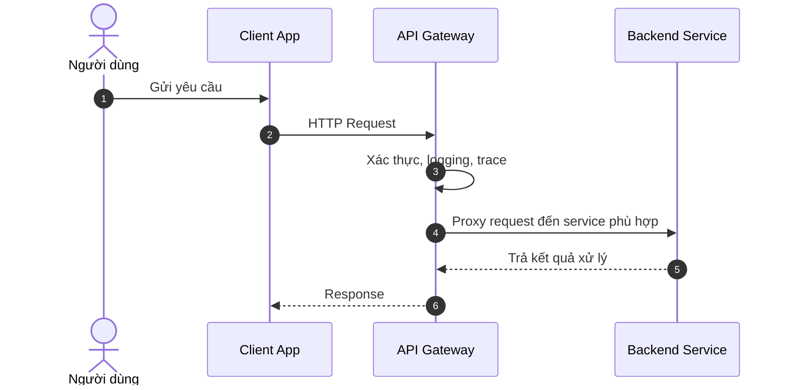
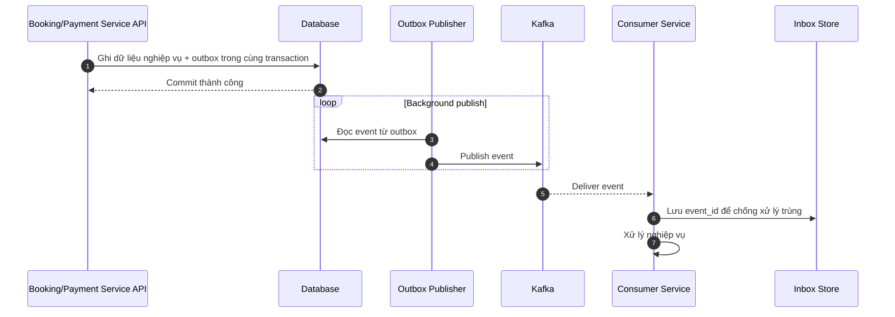
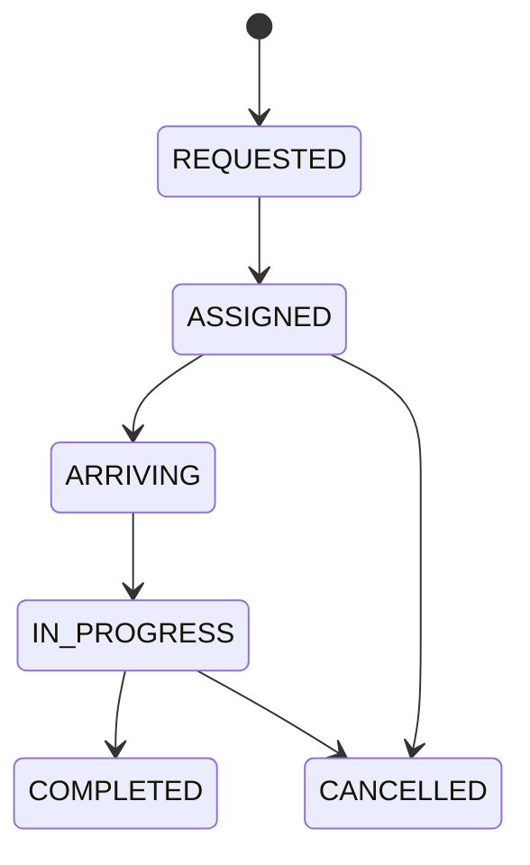
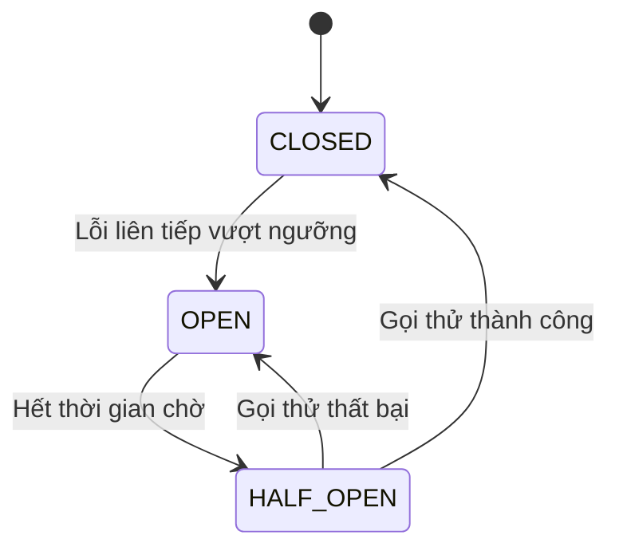
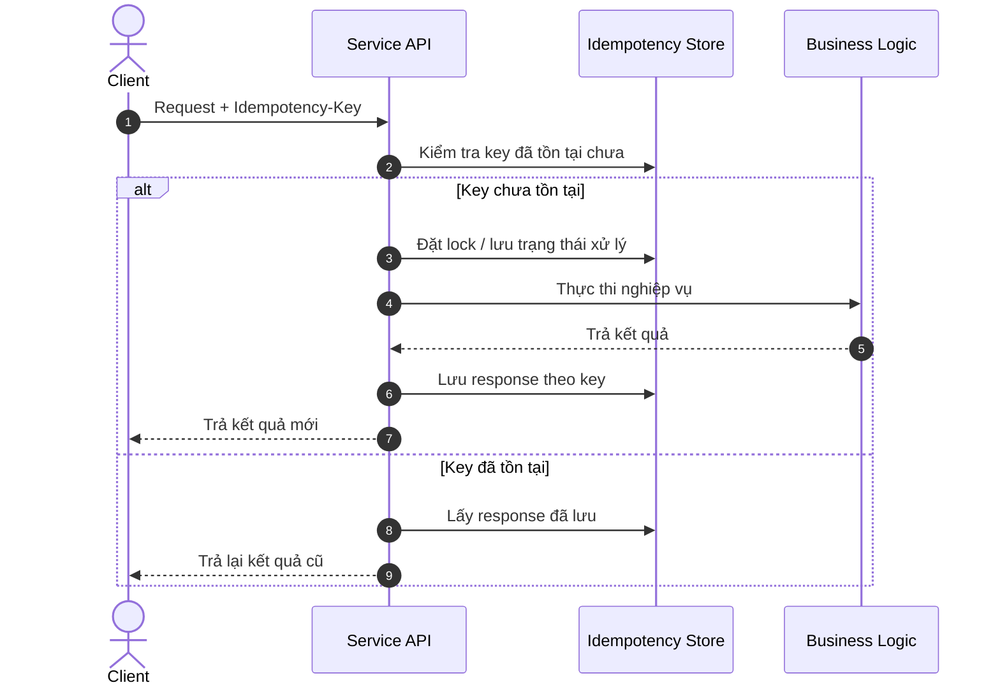

# Design Pattern Flows (Mermaid)

## 1) API Gateway / Proxy Pattern

## 2) Transactional Outbox + Inbox Pattern

## 3) State Machine Pattern

## 4) Circuit Breaker Pattern

## 5) Idempotency Pattern

