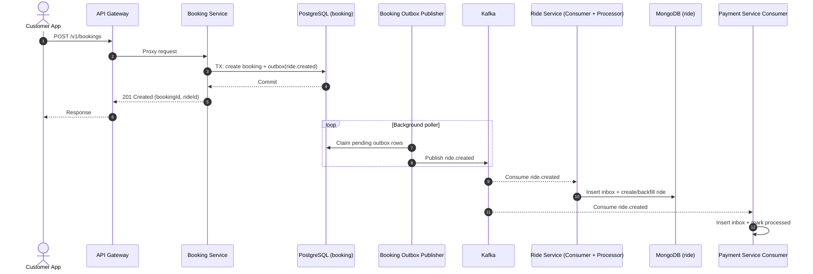
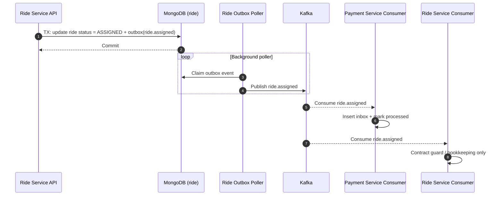
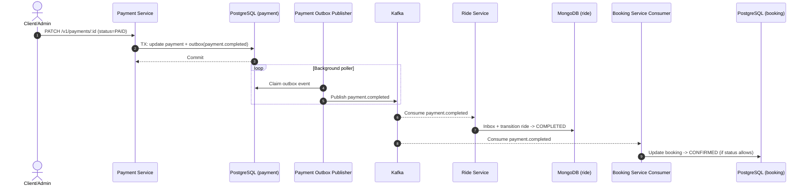
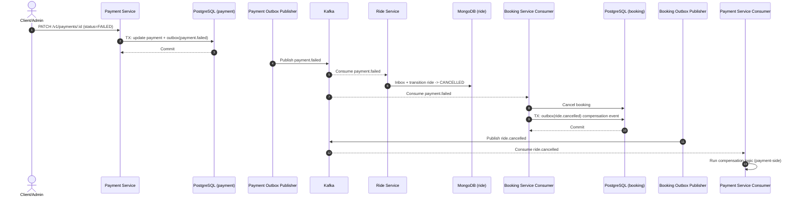
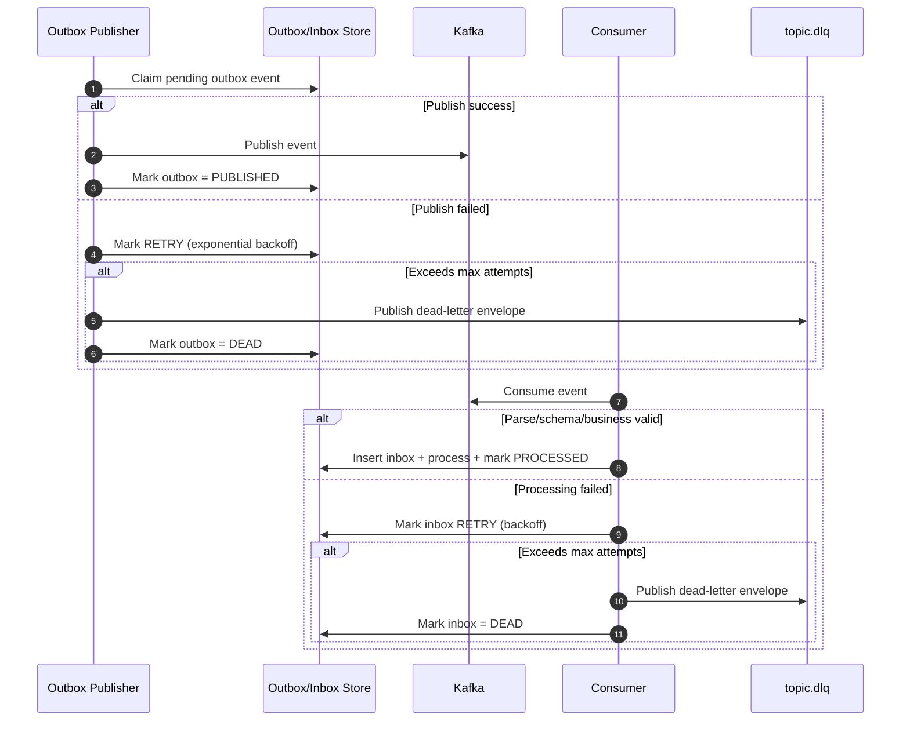
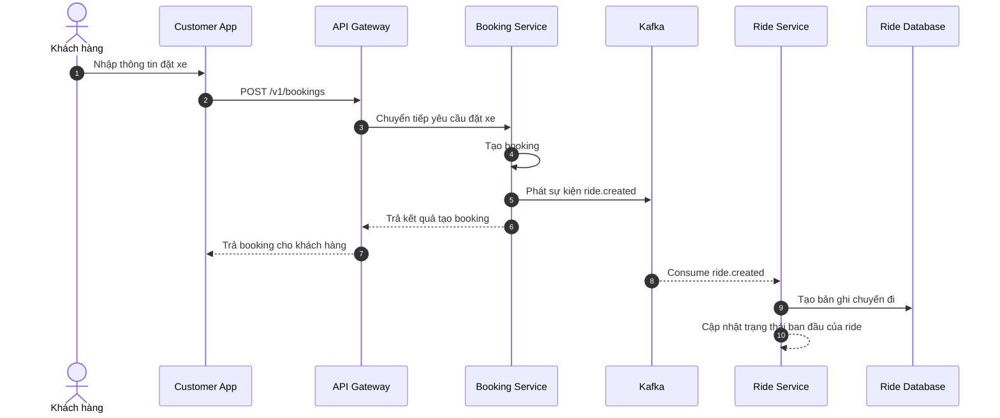
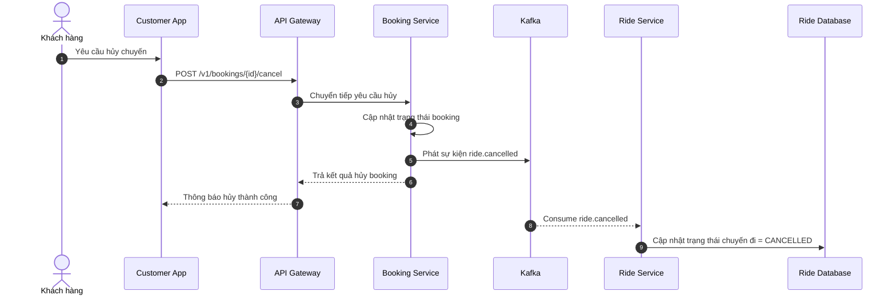
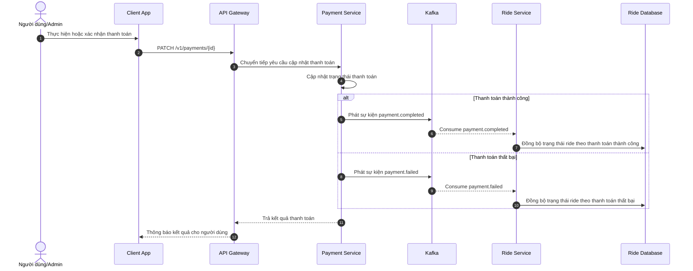

# Main Event Flows (Mermaid)

Source references: `contracts/events/topics.md`, `services/booking-service`, `services/ride-service`, `services/payment-service`.

## 1) Ride Created (`ride.created`)

## 2) Ride Assigned (`ride.assigned`)

## 3) Payment Completed (`payment.completed`)

## 4) Payment Failed + Compensation (`payment.failed` -> `ride.cancelled`)

## 5) Reliability Flow (Outbox/Inbox Retry + DLQ)

## 6) Business Flows For Report

### 6.1 Đặt xe

### 6.2 Hủy chuyến

### 6.3 Thanh toán

